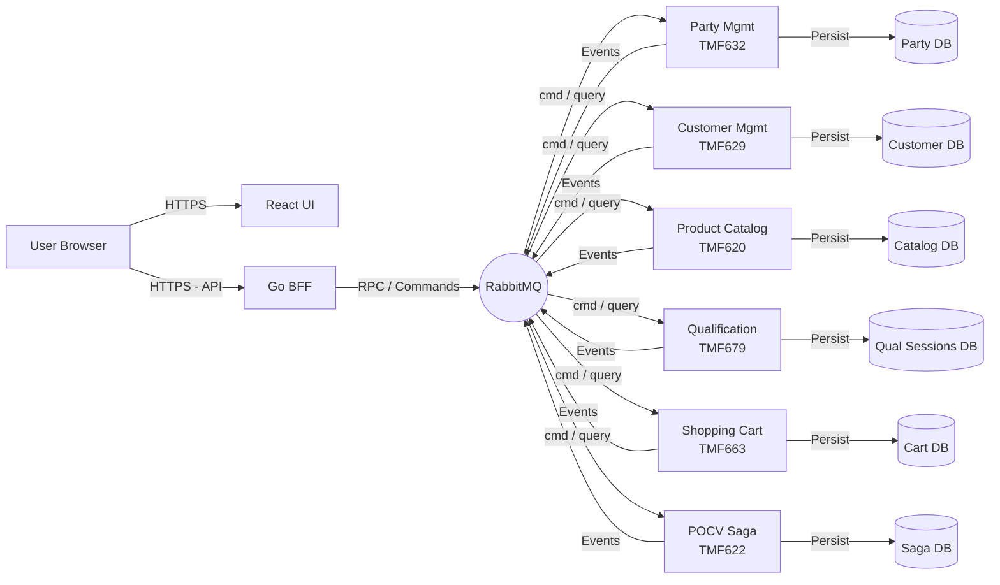
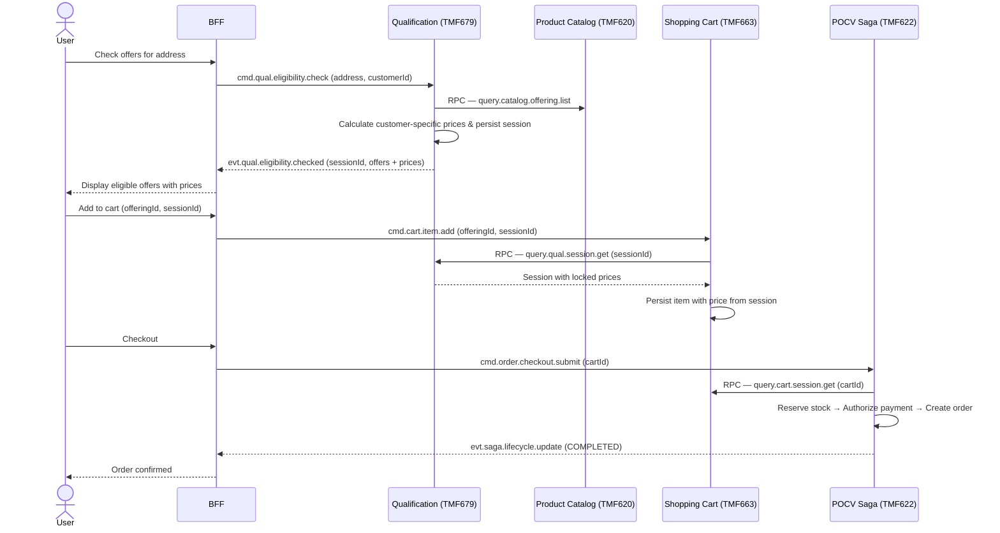

# TMF Demo Project

## 1. Project Goal

The primary goal of this project is to serve as a **demonstration and testing ground for software development driven entirely by Large Language Model (LLM) prompts**.

It aims to validate the capabilities of LLMs in architecting, implementing, and debugging complex, distributed systems that adhere to industry standards (specifically TM Forum REST APIs) while employing modern architectural patterns like Event-Driven Architecture and CQRS.

## 2. Overview of Application

The application implements a subset of the TM Forum (TMF) Open APIs, covering the full lifecycle from product discovery to order submission in a telecommunications context. It consists of seven main services:

### Services

1.  **Party Management Service (TMF632)**:
    *   **Role**: Manages identity information for **Individuals** and **Organizations**.
    *   **Key Features**: Party lifecycle (Create, Update, Delete), Contact Mediums, Identifications, and External References.
    *   **Source of Truth**: Serves as the central registry for "Who" a user is.

2.  **Customer Management Service (TMF629)**:
    *   **Role**: Manages the business relationship between the Enterprise and a Party.
    *   **Key Features**: Customer onboarding, Account management, Credit Profiles, and Tax Exemptions.
    *   **Dependency**: Every Customer record must reference an existing Party from the Party Management Service.

3.  **Product Catalog Management (TMF620)**:
    *   **Role**: Source of truth for commercial product offerings, specifications, and categories.
    *   **Key Features**: Full CRUD for Catalogs, Categories, Product Specifications, and Product Offerings (including pricing, attachments, and advanced filtering).

4.  **Qualification Service (TMF679)**:
    *   **Role**: Determines the technical and commercial eligibility of a product offering at a specific location.
    *   **Key Features**: **Scatter-Gather** pattern for parallel eligibility checks (GIS, Inventory, Catalog); **session-based** qualification to lock in customer-specific prices once and reuse them across the cart and checkout flow.

5.  **Shopping Cart Service (TMF663)**:
    *   **Role**: Manages transient customer selection state.
    *   **Key Features**: Item add/update/remove, optimistic locking for concurrent price updates, Transactional Outbox for reliable event publishing, and RPC endpoint for POCV to read the cart snapshot.

6.  **Product Order Capture & Validation (POCV — TMF C002/TMF622)**:
    *   **Role**: Central **Saga Orchestrator** for the checkout distributed transaction.
    *   **Key Features**: Coordinates stock reservation, payment authorization, and order creation across multiple services via asynchronous commands; compensates (rollback) on any failure; Timeout Monitor to detect and resolve stuck sagas.

7.  **Demo UI & BFF**:
    *   **Role**: A modern web interface for users to interact with the system.
    *   **Frontend**: React 19 application (Vite, TypeScript, TanStack Query) providing management pages for all entities.
    *   **Backend-for-Frontend (BFF)**: A Go service that acts as an API Gateway, handling Authentication (Auth0) and translating synchronous HTTP requests from the UI into asynchronous RabbitMQ messages for the backend services.

## 3. Architecture Overview

The system is built on a **100% Asynchronous, Event-Driven Architecture (EDA)** following **TM Forum ODA** standards.

### Core Principles
*   **Asynchronous Communication**: All inter-service communication happens via **RabbitMQ**. There are no direct HTTP calls between the core microservices.
*   **Command Query Responsibility Segregation (CQRS)**:
    *   **Commands (Write)**: Handled via distinct command topics (e.g., `cmd.party.create`, `cmd.catalog.offering.create`).
    *   **Events**: State changes are broadcasted as events (e.g., `evt.party.created`, `evt.cart.session.updated`).
    *   **Queries (Read)**: Handled via an **Async Request-Reply (RPC)** pattern over RabbitMQ to support data retrieval without REST endpoints.
*   **Clean / Hexagonal Architecture**: Every service follows a strict `core → usecase → adapter` layering. Domain logic has zero dependencies on infrastructure frameworks (GORM, AMQP, Gin).
*   **Transactional Outbox**: All services persist domain entities and outbox events in the same ACID transaction, guaranteeing at-least-once event delivery to RabbitMQ.
*   **Statelessness**: All services, including the BFF and UI, are designed to be stateless and horizontally scalable.
*   **Context Propagation**: Distributed tracing and timeouts are managed by propagating `context.Context` across all layers.

### High-Level Diagram



### End-to-End Order Flow

The following sequence shows how services collaborate from product discovery to order submission:



### Key Patterns

*   **RPC over RabbitMQ**: The BFF and inter-service calls simulate synchronous responses by listening to exclusive reply queues, allowing callers to await a response even though the backend is purely async.
*   **Saga Pattern (Orchestration)**: The POCV service is a stateful saga orchestrator that coordinates stock reservation, payment authorization, and order creation. It handles compensation (rollback) when any downstream step fails and includes a Timeout Monitor for stuck sagas.
*   **Scatter-Gather**: The Qualification service fans out concurrent RPC queries to GIS, Inventory, and Catalog services using `errgroup`, then aggregates the results into a single eligibility decision.
*   **Session-Based Pricing**: Qualification persists a session containing customer-specific prices in PostgreSQL. The Shopping Cart and POCV read this session via RPC to guarantee that the price shown to the customer is identical to the price charged.
*   **Transactional Outbox**: All state mutations (DB entity + outbox event) are written in a single transaction. A background worker polls the outbox and publishes events to RabbitMQ, ensuring no event is lost even if the broker is temporarily unavailable.
*   **Safe Dynamic Queries**: Strict patterns are enforced in the codebase to prevent SQL injection during dynamic filtering, using explicit switch-case column mapping instead of string interpolation.

## 4. Deployment Overview

### Local Development
The project includes a `docker-compose.yml` file for easy local setup.
```bash
docker-compose up --build
```
This spins up:
- Postgres (shared database server, separate DBs per service)
- RabbitMQ (Message Broker)
- Party Management Service (TMF632)
- Customer Management Service (TMF629)
- Product Catalog Management Service (TMF620)
- Demo UI & BFF

> **Note**: Qualification, Shopping Cart, and POCV services are not yet included in `docker-compose.yml` and must be run separately during development.

### Kubernetes
For production-like environments, the services are designed to be deployed on Kubernetes.
- **Secrets**: Sensitive data (DB URLs, RabbitMQ credentials) should be managed via K8s Secrets.
- **Deployments**: Each service is deployed as a stateless `Deployment` with a corresponding `Service`.
- **Configuration**: Environment variables (`DB_URL`, `RABBIT_URL`) are used to inject configuration.

*See `docs/KUBERNETES.md` for detailed manifest examples.*

## 5. Contribution

Contributions are welcome! Since this is a demo project for LLM-driven development:

1.  **Issues**: Please file issues on GitHub for any bugs, feature requests, or architectural gaps found.
2.  **LLM prompting**: When submitting a PR, it is encouraged to mention if the code was generated via LLM prompts and which model was used.

### Rules of Engagement
*   **Tests**: All new features must include unit and integration tests.
*   **Linting**: Ensure code passes `golangci-lint` and frontend linting rules.
*   **Docs**: Update the relevant `ANALYSIS.md` or `ARCHITECTURE.md` if you are changing the design or adding new features.
