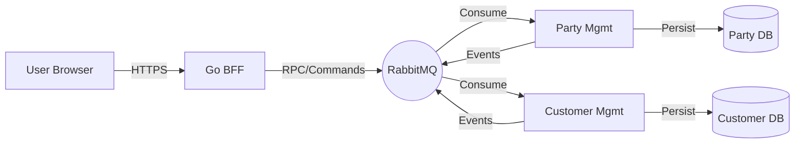

# TMF Demo Project

## 1. Project Goal

The primary goal of this project is to serve as a **demonstration and testing ground for software development driven entirely by Large Language Model (LLM) prompts**.

It aims to validate the capabilities of LLMs in architecting, implementing, and debugging complex, distributed systems that adhere to industry standards (specifically TM Forum REST APIs) while employing modern architectural patterns like Event-Driven Architecture and CQRS.

## 2. Overview of Application

The application implements a subset of the TM Forum (TMF) Open APIs to manage Parties and Customers in a telecommunications context. It consists of three main components:

### Services
1.  **Party Management Service (TMF632)**:
    *   **Role**: Manages identity information for **Individuals** and **Organizations**.
    *   **Key Features**: Party lifecycle (Create, Update, Delete), Contact Mediums, Identifications, and External References.
    *   **Source of Truth**: Serves as the central registry for "Who" a user is.

2.  **Customer Management Service (TMF629)**:
    *   **Role**: Manages the business relationship between the Enterprise and a Party.
    *   **Key Features**: Customer onboarding, Account management, Credit Profiles, and Tax Exemptions.
    *   **Dependency**: Every Customer record must reference an existing Party from the Party Management Service.

3.  **Demo UI & BFF**:
    *   **Role**: A modern web interface for users to interact with the system.
    *   **Frontend**: React 19 application (Vite, TypeScript, TanStack Query) providing management pages for Parties and Customers.
    *   **Backend-for-Frontend (BFF)**: A Go service that acts as an API Gateway, handling Authentication (Auth0) and translating synchronous HTTP requests from the UI into asynchronous RabbitMQ messages for the backend services.

## 3. Architecture Overview

The system is built on a **100% Asynchronous, Event-Driven Architecture (EDA)**.

### Core Principles
*   **Asynchronous Communication**: All inter-service communication happens via **RabbitMQ**. There are no direct HTTP calls between the core microservices.
*   **Command Query Responsibility Segregation (CQRS)**:
    *   **Commands (Write)**: Handled via distinct command topics (e.g., `cmd.party.create`).
    *   **Events**: State changes are broadcasted as events (e.g., `evt.party.created`).
    *   **Queries (Read)**: Handled via an **Async Request-Reply (RPC)** pattern over RabbitMQ to support data retrieval needs without REST endpoints.
*   **Statelessness**: All services, including the BFF and UI, are designed to be stateless and horizontally scalable.
*   **Context Propagation**: Distributed tracing and timeouts are managed by propagating `context.Context` across all layers.

### High-Level Diagram


### Key Patterns
*   **RPC over RabbitMQ**: The BFF simulates synchronous responses for the UI by listening to exclusive reply queues, allowing the frontend to await a response (like a search result) even though the backend is purely async.
*   **Saga Pattern**: Used for complex distributed transactions, such as the **Party Deletion Saga**. The Customer service validates if a Party can be deleted (checking for active subscriptions) and approves or rejects the deletion request asynchronously.
*   **Safe Dynamic Queries**: Strict patterns are enforced in the codebase to prevent SQL injection during dynamic filtering, using explicit switch-case mapping instead of string interpolation.

## 4. Deployment Overview

### Local Development
The project includes a `docker-compose.yml` file for easy local setup.
```bash
docker-compose up --build
```
This spins up:
- Postgres (Database)
- RabbitMQ (Message Broker)
- Party Management Service
- Customer Management Service
- Demo UI & BFF

### Kubernetes
For production-like environments, the services are designed to be deployed on Kubernetes.
- **Secrets**: Sensitive data (DB URLs, RabbitMQ credentials) should be managed via K8s Secrets.
- **Deployments**: Each service is deployed as a stateless `Deployment` with a corresponding `Service`.
- **Configuration**: Environment variables (`DB_URL`, `RABBIT_URL`) are used to inject configuration.

*See `docs/KUBERNETES.md` for detailed manifest examples.*

## 5. Contribution

Contributions are welcome! Since this is a demo project for LLM-driven development:

1.  **Issues**: Please file issues on GitHub for any bugs, feature requests, or architectural gaps found.
2.  **LLM prompting**: When submitting a PR, it is encouraged to mention if the code was generated via LLM prompts and which model was used.

### Rules of Engagement
*   **Tests**: All new features must include unit and integration tests.
*   **Linting**: Ensure code passes `golangci-lint` and frontend linting rules.
*   **Docs**: Update the relevant `ANALYSIS.md` or `ARCHITECTURE.md` if you are changing the design or adding new features.
