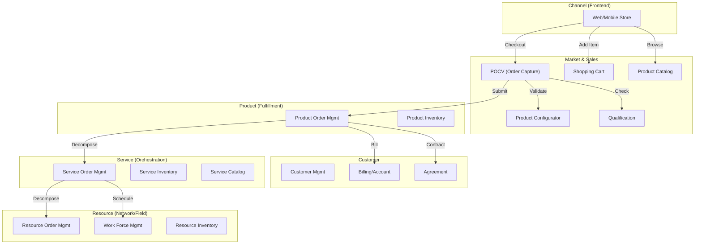
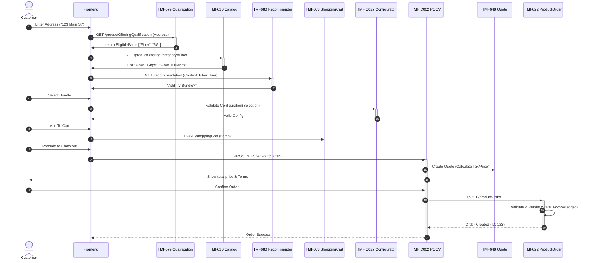
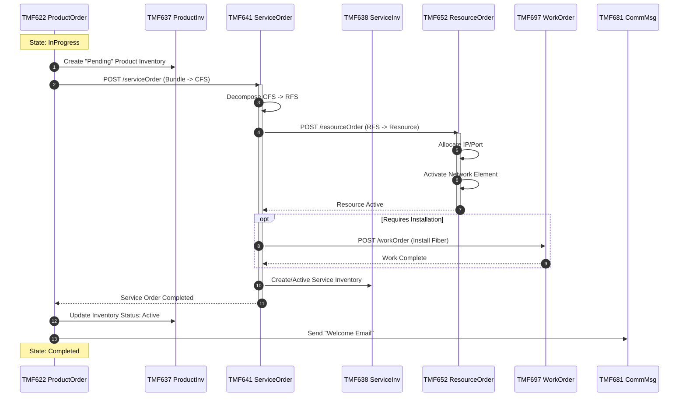
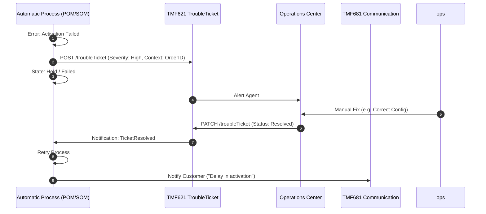

# Analysis: New Product Order Flow

## 1. Goal & Scope
To define the end-to-end architecture for the "New Product Order" flow, strictly adhering to **TM Forum Open Digital Architecture (ODA)** standards. This analysis defines the required microservices, their interaction patterns, and the detailed sequence of events from Catalog Browsing to Resource Activation.

## 2. ODA Component Landscape
The solution requires the following ODA software components, organized by domain.

### 2.1 Market & Sales Domain (Commerce)
These components manage the customer's shopping experience and capture the commercial intent.
*   **Product Order Capture & Validation (POCV)** `[TMF C002, TMF622]`:
    *   The central orchestrator for the checkout process.
    *   Aggregates calls to Quote, Eligibility, and Ordering.
*   **Shopping Cart Management** `[TMF663]`: Manages transient customer selection state.
*   **Product Offering Qualification** `[TMF679]`: Checks eligibility (e.g., "Is Fiber available at this address?").
*   **Product Configurator** `[TMF C027]`: Rules engine for validating complex bundle configurations.
*   **Quote Management** `[TMF648]`: Generates formal price quotes for B2B/complex scenarios.
*   **Recommendation Management** `[TMF680]`: Provides AI-driven up-sell/cross-sell offers.
*   **Product Catalog Management** `[TMF620]`: Source of truth for commercial offerings.
*   **Appointment Management** `[TMF646]`: Schedules field technicians during the ordering flow.
*   **Geographic Address Management** `[TMF673]`: Validates service locations.
*   **Promotion Management** `[TMF677]`: Applies campaigns and coupons.
*   **Policy Management** `[TMF644]`: Centralized business rules repository.

### 2.2 Customer Domain
These components manage the relationship and legal binding.
*   **Customer Management** `[TMF629]`: Profile and contact management.
*   **Party Management** `[TMF632]`: Individuals and organizations.
*   **Agreement Management** `[TMF651]`: Manages contracts, terms, and signatures.
*   **Customer Bill Management** `[TMF678]`: Generates billing documents.
*   **Account Management** `[TMF666]`: Manages billing accounts.
*   **Payment Management** `[TMF676]`: Handles payment transactions and gateways.
*   **Communication Management** `[TMF681]`: Sends Email/SMS notifications to customers.
*   **Loyalty Management** `[TMF658]`: Manages rewards/points earning from orders.
*   **Trouble Ticket Management** `[TMF621]`: Handles order fallout (errors/exceptions).
*   **SLA Management** `[TMF623]`: Tracks service level agreements for B2B orders.

### 2.3 Product Domain (Fulfillment Orchestration)
These components translate Commercial Intent into Technical Action.
*   **Product Ordering Management** `[TMF622]`: Master of the Commercial Order lifecycle.
*   **Product Inventory Management** `[TMF637]`: Tracks "what the customer has" (Subscription).

### 2.4 Service Domain (CFS/RFS)
These components manage the logical service instantiation.
*   **Service Catalog Management** `[TMF633]`: Defines CFS and RFS specifications (CFS=Customer Facing Service, RFS=Resource Facing Service).
*   **Service Ordering Management (SOM)** `[TMF641]`: Orchestrates technical service delivery.
*   **Service Inventory Management** `[TMF638]`: Tracks active service instances.
*   **Service Qualification Management** `[TMF645]`: Technical feasibility checks.
*   **Service Test Management** `[TMF653]`: Validates service functioning post-activation.
*   **Service Activation & Configuration** `[TMF640]`: Pushes config to network or NMS.

### 2.5 Resource Domain (Network)
These components manage physical/logical resources.
*   **Resource Catalog Management** `[TMF634]`: Defines physical resource specs (e.g., CPE model, Port type).
*   **Resource Ordering Management (ROM)** `[TMF652]`: Allocates specific resources.
*   **Resource Inventory Management** `[TMF639]`: Tracks installed assets (Sim Card, Router).
*   **Resource Pool Management** `[TMF691]`: Manages IP pools, VLANs, etc.
*   **Work Force Management** `[TMF697]`: Manages field work orders (installation).

---

## 3. High-Level Architecture (C2)
This diagram shows the primary relationships between the domains for the Order Flow.



---

## 4. Detailed Sequence Flows

### 4.1 Phase 1: Browse, Configure & Capture
**Goal**: Customer checks availability at their location, views *eligible* offers, configures one, and submits an order.

> [!IMPORTANT]
> **Performance Note**: To avoid checking thousands of offers, Step 1 performs a **Serviceability Check** (TMF679). It checks "Availability of Technology" (e.g., Is Fiber physically connected?) rather than validating every commercial rule. This returns a list of *eligible categories* (Fiber, 5G), which filters the subsequent Catalog Query. This reduces the search space from 10,000s to <10 valid offers.



### 4.2 Phase 2: E2E Fulfillment (Decomposition & Activation)
**Goal**: The Product Order is broken down into Service Orders and Resource Orders to provision the network.



---

## 5. Decomposition Logic
The central complexity lies in mapping Commercial Offers to Technical Services.

```mermaid
flowchart TD
    subgraph Commercial View
        PO[Product Order]
        Item1[Item: Internet Offering]
        Item2[Item: TV Offering]
        PO --> Item1 & Item2
    end

    subgraph Service View (CFS)
        SO[Service Order]
        CFS1[CFS: High Speed Internet]
        CFS2[CFS: IPTV Service]
    end

    subgraph Resource View (RFS + Res)
        RO[Resource Order]
        RFS1[RFS: GPON Access]
        RFS2[RFS: Multicast VLAN]
        Res1[Resource: ONT Device]
    end

    Item1 -->|Maps To| CFS1
    Item2 -->|Maps To| CFS2
    CFS1 -->|Decomposes To| RFS1
    CFS2 -->|Decomposes To| RFS2
    RFS1 -->|Requires| Res1
```

## 6. Fallout Management
Handling errors (e.g., "Port not available", "Technician failed", "Payment declined").



---

## 7. Microservice Architecture Guidelines
New services must follow these technical patterns:

### 7.1 Hexagonal Architecture
*   **Domain**: Pure business logic, no framework dependencies.
*   **UseCase**: Application specific business rules, orchestrates Domain.
*   **Adapter (Primary/Driving)**: HTTP Handlers (Gin/Echo), gRPC.
*   **Adapter (Secondary/Driven)**: Postgres Repo (GORM/Pgx), RabbitMQ Publisher.

### 7.2 Communication Patterns
*   **Synchronous (HTTP/gRPC)**: Only for Read operations or "Must-Succeed-Now" validations (e.g. `checkEligibility`).
*   **Asynchronous (Events)**: All state changes across boundaries (e.g., `ProductOrderCreated` event triggers `ServiceOrder`).
*   **Reliability**:
    *   **Transactional Outbox**: Save data and event to DB in one transaction.
    *   **Idempotent Consumer**: Handle duplicate events gracefully.
