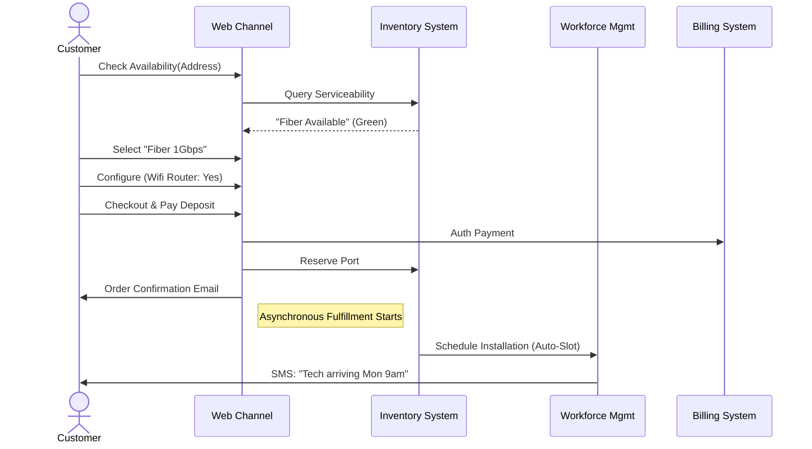

# Master Analysis: Fiber Internet Implementation Specification

**Version**: 1.0
**Status**: DRAFT
**Scope**: End-to-End Implementation of "Fiber 1Gbps" Product Line
**Compliance**: TM Forum ODA / Open API

---

# 1. Executive Summary
This document serves as the canonical technical specification for the Fiber Internet product. It defines the exact data structures, API interactions, and business logic required to implement the full "Order-to-Cash" lifecycle. It is intended for Architects, Developers, and QA Engineers.

## 1.1 Scope Definition
| Domain | In Scope | Out of Scope |
| :--- | :--- | :--- |
| **Market** | Catalog definition, Recommender rules, Qualification logic. | Marketing Campaign creation UI. |
| **Sales** | Shopping Cart, Checkout/POCV, Credit Check, Quote. | Assisted Sales (CRM UI). |
| **Fulfillment** | Order Decomposition, Service Order, Resource Allocation. | Physical Network Construction (Civil Works). |
| **Assurance** | SLA logic, Trouble Ticket creation on failure. | Network Fault Monitoring (NOC screens). |
| **Billing** | Rating, Invoicing, Payment Capture. | Dunning/Collections process. |

---

# 2. Business Process Architecture (BPMN)

## 2.1 Customer Journey: New Connect (Happy Path)
**Goal**: User successfully purchases Fiber Internet at a serviceable address.



## 2.2 Exception Flow: Feasibility Failure
**Goal**: Handle address where Fiber is not yet built but planned.
1.  **Check Availability**: Returns "Planned / Build Required".
2.  **Lead Capture**: User submits "Notify Me" form (Lead Entity).
3.  **Process**: `Lead` -> `GeoAnalysisTask` -> `ManualReview`.

---

# 3. Data Architecture (The "Gold Model")
This section defines the EXACT JSON structures to be seeded.

## 3.1 Product Catalog (TMF620)
The commercial definition.

### 3.1.1 Product Specification: `PS_FIBER_INT`
The technical template for the internet service.

```json
{
  "id": "PS_FIBER_INT",
  "name": "Fiber Internet Spec",
  "lifecycleStatus": "Active",
  "productSpecCharacteristic": [
    {
      "name": "DownloadSpeed",
      "valueType": "String",
      "configurable": true,
      "productSpecCharacteristicValue": [
        {"value": "500Mbps", "isDefault": false},
        {"value": "1000Mbps", "isDefault": true},
        {"value": "2000Mbps", "isDefault": false}
      ]
    },
    {
      "name": "UploadSpeed",
      "valueType": "String",
      "configurable": false,
      "productSpecCharacteristicValue": [
        {"value": "SameAsDownload", "isDefault": true}
      ]
    },
    {
      "name": "SLA_Level",
      "valueType": "String",
      "productSpecCharacteristicValue": [
        {"value": "BestEffort", "isDefault": true},
        {"value": "Gold", "isDefault": false}
      ]
    }
  ]
}
```

### 3.1.2 Product Offering: `PO_FIBER_1G_BUNDLE`
The sellable bundle including Router.

```json
{
  "id": "PO_FIBER_1G_BUNDLE",
  "name": "GigaHome Fiber Deal",
  "isBundle": true,
  "bundledProductOffering": [
    {
      "id": "PO_FIBER_SERVICE",
      "name": "Fiber Connectivity",
      "productOfferingPrice": [{"price": {"value": 50, "unit": "EUR"}, "priceType": "recurring"}]
    },
    {
      "id": "PO_WIFI6_ROUTER",
      "name": "Wifi 6 Router",
      "productOfferingPrice": [{"price": {"value": 0, "unit": "EUR"}, "priceType": "one_time"}]
    }
  ]
}
```

## 3.2 Service Catalog (TMF633)
The logical derivation of the product.

### 3.2.1 Customer Facing Service (CFS): `CFS_HSI`
```json
{
  "id": "CFS_HSI",
  "name": "High Speed Internet CFS",
  "serviceSpecCharacteristic": [
    {"name": "ProfileID", "description": "Radius Profile"},
    {"name": "VlanID", "description": "C-VLAN tag"}
  ]
}
```

### 3.2.2 Resource Facing Service (RFS): `RFS_GPON`
```json
{
  "id": "RFS_GPON",
  "name": "GPON Port Service",
  "serviceSpecCharacteristic": [
    {"name": "OltID", "description": "Target Network Element"},
    {"name": "SlotPort", "description": "Physical Port: 1/1/4"}
  ]
}
```

---

# 4. Interface Specifications (API Contracts)

## 4.1 Qualification (TMF679)
**Endpoint**: `POST /productOfferingQualification`
**Logic**: GIS Polygon Check + Resource Port Count.

**Request Payload**:
```json
{
  "instantSyncQualification": true,
  "productOfferingQualificationItem": [
    {
      "id": "1",
      "product": {
        "place": [
          {"role": "InstallationAddress", "id": "ADDR_BERLIN_55"}
        ]
      }
    }
  ]
}
```

**Response Payload**:
```json
{
  "productOfferingQualificationItem": [
    {
      "id": "1",
      "qualificationItemResult": "Qualified",
      "eligibleProductOfferingCategories": [{"id": "CAT_FIBER"}],
      "product": {
        "productCharacteristic": [
          {"name": "MaxSpeed", "value": "1000Mbps"},
          {"name": "Technology", "value": "GPON"}
        ]
      }
    }
  ]
}
```

## 4.2 Product Order (TMF622) - The "Canonical" Order
**Endpoint**: `POST /productOrder`
**Critical Fields**:
*   `place`: MUST be copied from Qualification.
*   `productCharacteristic`: MUST be validated against TMF620.
*   `billingAccount`: MUST exist in TMF666.

**Payload**:
```json
{
  "externalId": "ORD_1001",
  "productOrderItem": [
    {
      "id": "1",
      "action": "add",
      "productOffering": {"id": "PO_FIBER_1G_BUNDLE"},
      "product": {
        "productSpecification": {"id": "PS_FIBER_INT"},
        "place": [{"role": "InstallationAddress", "id": "ADDR_BERLIN_55"}],
        "productCharacteristic": [
          {"name": "DownloadSpeed", "value": "1000Mbps"}
        ]
      }
    }
  ]
}
```

---

# 5. Orchestration Logic ("The Brain")

## 5.1 POCV State Machine
The Checkout Saga (POCV Service).

| State | Trigger | Action | Next State | Error State |
| :--- | :--- | :--- | :--- | :--- |
| `Draft` | User adds item | Call TMF663 AddItem | `Active` | `Draft` |
| `Active` | User clicks Checkout | 1. Lock Inventory<br>2. Calculate Tax | `Pricing` | `Active` |
| `Pricing` | User confirms | Call TMF666 CreditCheck | `Validating` | `Active` |
| `Validating`| Check OK | Map Cart->Order | `Converting` | `Review` |
| `Converting`| Mapped | Call TMF622 Submit | `Submitted` | `Failed` |

## 5.2 Decomposition Logic (TMF622 -> TMF641)
How to split the bundle.

**Matrix**:
| Product | Characteristic | Service (CFS) | Attribute | Value Logic |
| :--- | :--- | :--- | :--- | :--- |
| `PO_FIBER`| `Speed=1000` | `CFS_HSI` | `ProfileID` | `PROFILE_1G_GOLD` |
| `PO_FIBER`| `SLA=BestEffort`| `CFS_HSI` | `QoS` | `BE` |
| `PO_FIBER`| `Place=Addr_55` | `CFS_HSI` | `SiteID` | `Lookup(Addr_55)` |

**Algorithm**:
1.  Loop through `ProductOrderItem`.
2.  If `Offering.Type == Connectivity`: Create `ServiceOrderItem` for `CFS_HSI`.
3.  Inject Attributes from Matrix.
4.  If `Offering.Type == Device`: Create `ServiceOrderItem` for `RFS_CPE` (Shipping request).

---

# 6. Operational Readiness

## 6.1 Logging & Tracing
*   **TraceID**: Must be generated at Ingress (Nginx) and propagated via `X-Request-ID` header to all 15 microservices.
*   **Log Context**: Every log line must include `orderId`, `customerId`, `cartId`.

## 6.2 Metrics (Prometheus)
*   `pocv_checkout_latency_seconds`: Histogram bucketed.
*   `qualification_success_count`: Counter (breakdown by city).
*   `decomposition_error_count`: Counter (Critical alert).

## 6.3 Configuration
*   **Feature Flags**:
    *   `ENABLE_XGS_PON_CHECK`: Toggle for 10Gbps pilot.
    *   `SKIP_CREDIT_CHECK`: For VIP customers (Configurable list).

---
**End of Specification**
