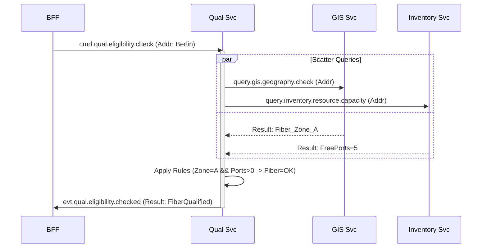

# Design 02: Async Serviceability Check (Qualification)

## 1. Overview
This design details the strictly asynchronous implementation of the **Qualification Process** (TMF679 CheckEligibility). Unlike the synchronous Analysis, this flow uses a **Scatter-Gather** pattern to query multiple backends (GIS, Inventory, History) in parallel without blocking.

## 2. The Logic Flow (Scatter-Gather)
The `qualification-service` does not own the data. It orchestrates queries to domains that do.



## 3. Topics & Payloads

### 3.1 Command: `cmd.qual.eligibility.check`
**Queue**: `q.qual.command`
**Payload**:
```json
{
  "address": {
    "street": "Main St",
    "number": "123",
    "city": "Berlin",
    "zip": "10115"
  },
  "categoryFilter": ["Internet", "TV"]
}
```

### 3.2 Query: `query.inventory.resource.capacity`
**Topic**: `query.inventory.capacity` (RPC Pattern)
**Payload**:
```json
{
  "locationId": "CABINET_BERLIN_05", // Resolved from Address
  "resourceType": "OLT_PORT"
}
```
**Response**:
```json
{
  "total": 16,
  "used": 11,
  "reserved": 0,
  "free": 5
}
```

### 3.3 Event: `evt.qual.eligibility.checked`
**Topic**: `evt.qual.eligibility.checked`
**Payload**:
```json
{
  "qualificationId": "Q_123",
  "status": "Qualified",
  "eligibleCategories": [
    {
      "id": "CAT_FIBER",
      "characteristics": [
         {"name": "MaxSpeed", "value": "1000Mbps"}
      ]
    }
  ]
}
```

## 4. Internal Implementation (Go)

### 4.1 Coroutine Management
The `UseCase.CheckEligibility` function will spawn goroutines for each query.

```go
func (u *QualUseCase) Check(ctx context.Context, cmd CheckCmd) {
    g, ctx := errgroup.WithContext(ctx)
    
    // 1. GIS Query
    var gisResult GISData
    g.Go(func() error {
        gisResult = u.gisClient.QueryPolygon(ctx, cmd.Address)
        return nil
    })

    // 2. Inventory Query
    var invResult InvData
    g.Go(func() error {
        invResult = u.invClient.QueryCapacity(ctx, cmd.Address)
        return nil
    })

    // Wait
    if err := g.Wait(); err != nil {
        u.publisher.PublishError(ctx, err)
        return
    }

    // 3. Aggregate & Decide
    eligibility := u.ruleEngine.Evaluate(gisResult, invResult)
    
    // 4. Publish Event
    u.publisher.PublishEvent(ctx, "evt.qual.checked", eligibility)
}
```

## 5. Performance Considerations
*   **Timeouts**: The Scatter-Gather must have a strict timeout (e.g., 500ms). If `Inventory` is slow, return "Check Unavailable" or fallback to "Cached Data".
*   **Caching**: GIS Polygon results should be heavily cached (Redis) as they change rarely.
