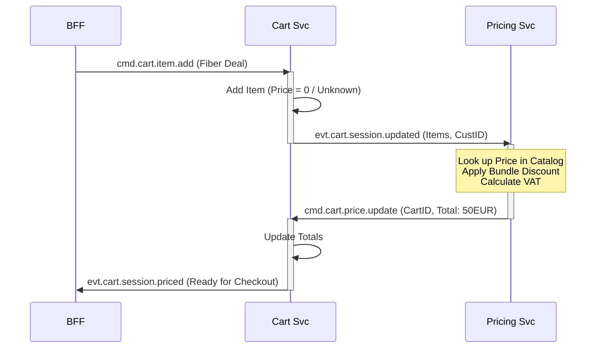

# Design 03: Async Cart & Pricing (Reactive)

## 1. Overview
The Shopping Cart is a **Reactive State Machine**. It does not calculate prices itself. Instead, it maintains the list of items and reacts to `evt.pricing.calculated` events from a dedicated Pricing Service. This decoupling allows complex pricing rules (tax, bundles, discounts) to evolve independently of the Cart.

## 2. The Logic Flow (Event Ping-Pong)
This pattern is known as **Choreography**.



## 3. Topics & Payloads

### 3.1 Command: `cmd.cart.item.add`
**Queue**: `q.cart.command`
**Payload**:
```json
{
  "cartId": "CART_123",
  "offeringId": "PO_FIBER_1G",
  "quantity": 1
}
```

### 3.2 Event: `evt.cart.session.updated` (The Trigger)
Broadcast when the user modifies structure.
**Payload**:
```json
{
  "cartId": "CART_123",
  "items": [
    {"id": "metrics-1", "offeringId": "PO_FIBER_1G", "params": {...}}
  ],
  "customer": {"id": "CUST_555", "region": "EU_DE"}
}
```

### 3.3 Command: `cmd.cart.price.update` (The Callback)
Sent by Pricing Service back to Cart Service.
**Payload**:
```json
{
  "cartId": "CART_123",
  "itemPrices": [
    {
      "itemId": "metrics-1", 
      "unitPrice": 50.00,
      "discounts": [{"name": "Bundle Promo", "amount": -10.00}]
    }
  ],
  "totalPrice": {
    "taxIncluded": 40.00,
    "currency": "EUR"
  }
}
```

## 4. Handling Race Conditions
Since the user might add Item B while Pricing is calculating Item A:
*   **Version Check**: `evt.cart.session.updated` includes a `version` (int).
*   **Optimistic Locking**: `cmd.cart.price.update` includes `for_version`.
*   **Logic**: If Cart is now at Version 5, but Pricing sends prices for Version 4, the Cart **discards** the price update. (The Cart knows a new `evt.cart.session.updated` for V5 was already sent and a new Price is coming).

## 5. Pricing Engine Internals
The Pricing Service is stateless.
1.  **Catalog Lookup**: `query.catalog.offering.get` (Async RPC).
2.  **Tax Calculation**: External Tax Provider or Internal Rule.
3.  **Campaign Check**: Query `promotion-service` for active coupons.

This design ensures the Cart is "fast & dumb" while Pricing is "slow & smart".
