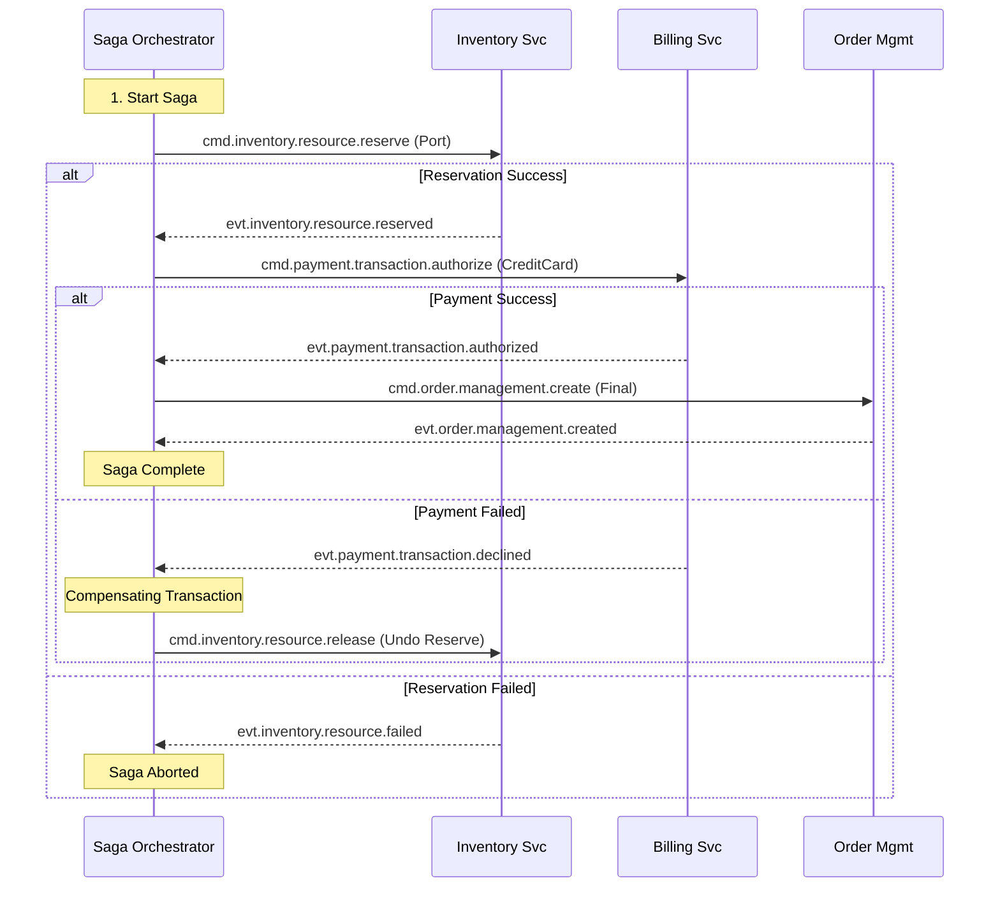

# Design 04: Order Capture Saga (POCV Implementation)

## 1. Overview
The Checkout process is a **Distributed Transaction** spanning Inventory, Billing, and Ordering. We implement this using the **Saga Pattern** (Orchestration). The `pocv-service` acts as the Saga Orchestrator.

## 2. The Saga Flow
**Goal**: Create Order AND Reserve Port AND Charge Credit Card.



## 3. POCV State Machine (Persistent)
The Saga State must be persisted to DB to survive crashes.

**Table: `saga_instances`**
| ID | CurrentStep | State | Payload | UpdatedAt |
| :--- | :--- | :--- | :--- | :--- |
| `SAGA_1` | `INVENTORY` | `PENDING` | `{cartId: "123"}` | 10:00:01 |

### 3.1 Step Transitions
1.  **Event Received**: `evt.inventory.resource.reserved`.
2.  **Load Saga**: Find `SAGA_1` where `state=PENDING`.
3.  **Update State**: Set `CurrentStep=PAYMENT`.
4.  **Emit Command**: Publish `cmd.payment.transaction.authorize`.
5.  **Save**: Commit DB.

## 4. Topics & Payloads

### 4.1 Inventory Reservation
**Command**: `cmd.inventory.resource.reserve`
```json
{
  "sagaId": "SAGA_1",
  "resources": [{"type": "OLT_PORT", "location": "BERLIN"}]
}
```

### 4.2 Payment Auth
**Command**: `cmd.payment.transaction.authorize`
```json
{
  "sagaId": "SAGA_1",
  "amount": 100.00,
  "token": "tok_visa_123"
}
```

### 4.3 Compensation (Undo)
If Payment fails, we must undo the Inventory reservation.
**Command**: `cmd.inventory.resource.release`
```json
{
  "sagaId": "SAGA_1",
  "reason": "PaymentDeclined"
}
```

## 5. Idempotency
Because RabbitMQ guarantees "At Least Once" delivery, the Orchestrator might receive `evt.inventory.resource.reserved` twice.
*   **Requirement**: All Saga event handlers must be idempotent.
*   **Implementation**: "If Saga is already in step `PAYMENT`, ignore the duplicate `evt.inventory.resource.reserved`."

## 6. Timeouts
If a Saga stays in `PENDING` for > 5 minutes (e.g., Inventory never replies), a **Saga Monitor** background job will:
1.  Mark Saga as `TIMED_OUT`.
2.  Execute Compensating Commands for *completed* steps (e.g., Release Inventory).
3.  Notify User via WebSocket/Email.
