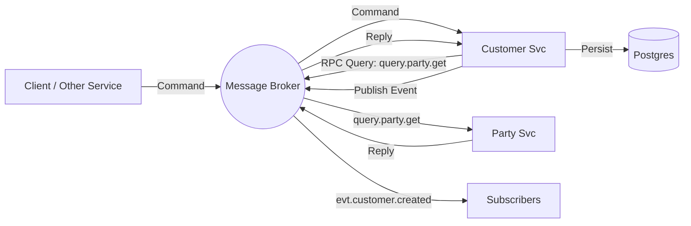

# Architecture: Asynchronous Customer Management (TMF629)

## Overview
This document defines the architecture for the Customer Management service. Following the project's core architectural standards, this service is **100% Asynchronous** and uses a Message Broker (RabbitMQ) for all external interactions.

## 1. Core Principles

### 1.1 Context Propagation
**Requirement**: All methods across all layers (Domain, Infrastructure, Transport) MUST accept `context.Context` as their first parameter.

**Rationale**:
- **Timeout Control**: Ensures database and broker operations are bound by time.
- **Cancellation**: Allows the service to halt processing upon client disconnect or system shutdown.
- **Observability**: Carries trace IDs and other relevant metadata through the system.

### 1.2 Error Handling
- Use domain-specific errors defined in `internal/domain/errors.go`.
- Map infrastructure-specific errors (e.g., `gorm.ErrRecordNotFound`) to domain errors at the boundary.
- Always wrap errors with `%w` to preserve context and type.

### 1.3 Resilience & Consistency
- **RabbitMQ**: Use `ConnectionManager` for automatic reconnection logic.
- **Graceful Shutdown**: Implement `Close()` methods and use `sync.WaitGroup` to ensure all active processing completes before exit.
- **Eventual Consistency**: Since this service depends on the Party Management service, it must handle scenarios where party data is not yet available or is being updated asynchronously.

### 1.4 Logging
- Use structured logging (`log/slog`) with relevant attributes (e.g., `customer_id`, `party_id`).

## 2. Communication Pattern
We will use an **Event-Driven Architecture (EDA)** with the following patterns:

### 2.1 Command-Query Responsibility Segregation (CQRS)
*   **Commands (Write)**: Sent as messages to a command topic. The service consumes them, processes the logic, persists state, and emits events.
*   **Events (State Changes)**: Published to an event stream whenever the state changes.
*   **Queries (Read)**: Handled via an **Async Request-Reply** pattern over the message bus.

### 2.2 Message Topology
We categorize topics/subjects into three types:
*   `cmd.customer.<action>`: For requesting an action (e.g., Create, Update, Suspend).
*   `evt.customer.<state>`: For broadcasting state changes (e.g., Created, StatusChanged).
*   `query.customer.<lookup>`: For retrieving data (e.g., GetById, Search).

## 3. Interface Definition (AsyncAPI)

### 3.1 Commands (Inputs)
| Topic / Subject | Payload Schema | Description |
| :--- | :--- | :--- |
| `cmd.customer.create` | `CustomerCreateEvent` | Request to onboard a new customer (linked to a Party). |
| `cmd.customer.update` | `CustomerUpdateEvent` | Request to update customer attributes or preferences. |
| `cmd.customer.delete` | `CustomerDeleteEvent` | Request to terminate/remove a customer record. |
| `cmd.customer.patch` | `CustomerPatchEvent` | Request for partial updates to the customer profile. |

*   **Behavior**: The service acknowledges receipt immediately (ACK), but processing is asynchronous.
*   **Outcome**: If successful, an event is emitted. If failed, a failure notification is published.

### 3.2 Events (Outputs)
Adhering to TMF629 Notification patterns:
| Topic / Subject | Payload Schema | Trigger |
| :--- | :--- | :--- |
| `evt.customer.created` | `Customer` | Successfully onboarded a customer. |
| `evt.customer.updated` | `Customer` | Successfully updated a customer profile. |
| `evt.customer.deleted` | `CustomerDeleteNotification` | Successfully removed a customer. |
| `evt.customer.statusChanged` | `CustomerStatusChange` | Customer state changed (e.g., Active -> Suspended). |

### 3.3 Queries (Async Request-Reply)
To support retrieval without REST:
*   **Queue**: `query.customer.get`
*   **Pattern**: RPC (Remote Procedure Call) utilizing `reply_to` and `correlation_id` properties.
*   **Request**: `{"id": "cust-123"}`
*   **Response**: `Customer` object JSON (including Party reference details).

## 4. Technology Stack Selection
To implement this efficiently in Go:
*   **Message Broker**: **RabbitMQ**.
*   **Marshalling**: **JSON**.
*   **Library**: `github.com/rabbitmq/amqp091-go`.
*   **Database**: **PostgreSQL** with **GORM**.

## 5. Internal Component Structure
The service will consist of:
1.  **RabbitMQ Adapter**: Manages connection and channels.
2.  **Party Client**: An internal RabbitMQ RPC client to fetch identity data from the Party service.
3.  **Service Layer**: Business logic (Integration rules, validation).
4.  **Repository Layer**: PostgreSQL access.

## 6. Deployment Diagram

