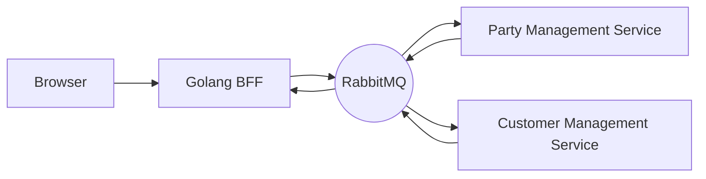
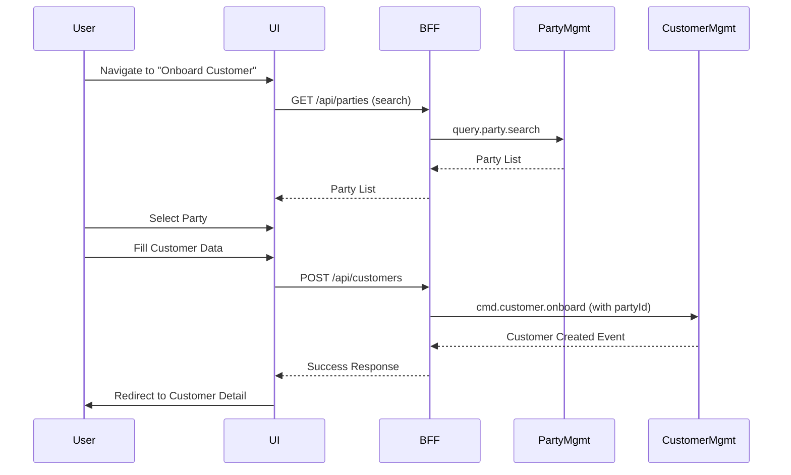
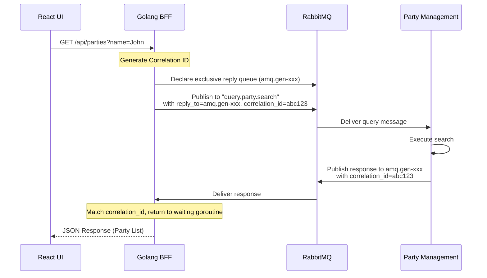

# Demo UI Analysis Document

> This document captures all use cases for the Demo UI, mapping functionality to the Party Management (TMF632) and Customer Management (TMF629) microservices, and defining requirements for a RabbitMQ Debug View.

---

## 1. Overview

The Demo UI provides a web-based interface to interact with the TMF microservices architecture. It communicates with the Backend-for-Frontend (BFF), which translates HTTP requests into RabbitMQ messages for the backend services.



---

## 2. Party Management Use Cases (TMF632)

The Party Management service manages **Individuals** (persons) and **Organizations** (companies).

### 2.1 Supported Operations

| Use Case | RabbitMQ Topic | UI Page/Component | Description |
|:---------|:---------------|:------------------|:------------|
| **Create Individual** | `cmd.party.create` | Party Form (Create Mode) | Register a new person with name, contact mediums, identifications, and related parties. |
| **Create Organization** | `cmd.party.create` | Party Form (Create Mode) | Register a new company with trading name, legal entity flag, and contact mediums. |
| **Update Party** | `cmd.party.update` | Party Form (Edit Mode) | Modify all attributes of an existing party. |
| **Patch Party** | `cmd.party.patch` | Inline Edit / Quick Actions | Partially update specific fields (e.g., status change). |
| **Delete Party** | `cmd.party.delete` | Party List (Action Menu) | Remove a party record (GDPR compliance). |
| **Get Party by ID** | `query.party.get` | Party Detail View | Retrieve full details of a specific party. |
| **Search Parties** | `query.party.search` | Party List View | Search by name, type, or identification criteria. |

### 2.2 Party Sub-Resources

The UI must support managing the following sub-resources within the Party context:

| Sub-Resource | Fields | UI Component |
|:-------------|:-------|:-------------|
| **Contact Medium** | Type (Email, Phone, Address), Preferred flag, Value/Address fields | Repeatable Form Section |
| **Identification** | Type (Passport, SSN), ID Number, Issuing Authority, Dates | Repeatable Form Section |
| **Related Party** | Related Party ID, Name, Role (e.g., "Employee of") | Relationship Manager Component |
| **Characteristic** | Name, Value, Value Type | Dynamic Key-Value Editor |

### 2.3 UI Pages for Party Management

1.  **Party List Page** (`/parties`)
    -   Data grid with search, filter, and sort capabilities.
    -   Columns: ID, Type (Individual/Organization), Name, Status, Created Date.
    -   Actions: View, Edit, Delete.

2.  **Party Detail Page** (`/parties/:id`)
    -   Read-only view of all party data.
    -   Tabs for: Overview, Contact Mediums, Identifications, Related Parties, Characteristics.

3.  **Party Create/Edit Page** (`/parties/new`, `/parties/:id/edit`)
    -   Form with sections for all sub-resources.
    -   Party type selector (Individual/Organization) with dynamic field display.

---

## 3. Customer Management Use Cases (TMF629)

The Customer Management service manages the **business relationship** with a Party. Every Customer references a Party.

### 3.1 Supported Operations

| Use Case | RabbitMQ Topic | UI Page/Component | Description |
|:---------|:---------------|:------------------|:------------|
| **Onboard Customer** | `cmd.customer.onboard` | Customer Online Form | Create a new customer linked to an existing Party, including accounts, credit profile, and consents. |
| **Update Customer** | `cmd.customer.update` | Customer Edit Form | Update customer status, tax exemptions, and privacy consents. |
| **Patch Customer** | `cmd.customer.patch` | Inline Edit / API | Partially update specific fields (supported by backend). |
| **Get Customer by ID** | `query.customer.get` | Customer Detail View | Retrieve full customer details with related party data. |
| **Search Customers** | `query.customer.search` | Customer List View | Search by name, status, or party ID. |
| **Delete Customer** | `cmd.customer.delete` | Customer List (Action Menu) | Remove a customer record. |

### 3.2 Customer Sub-Resources

| Sub-Resource | Fields | UI Component |
|:-------------|:-------|:-------------|
| **Customer Account** | ID, Name, Status, Type | Account Card / List |
| **Credit Profile** | Credit Score, Risk Score | Read-Only Profile Section |
| **Contact Medium** | Specific to customer relationship | Repeatable Form Section |
| **Characteristic** | Dynamic attributes | Key-Value Editor |
| **Tax Exemption** | Certificate Number, Jurisdiction, Validity | Repeatable Form Section |
| **Privacy Consent** | Consent Type, Status, Valid From | Consent Manager Component |

### 3.3 UI Pages for Customer Management

1.  **Customer List Page** (`/customers`)
    -   Data grid with search, filter, and sort.
    -   Columns: ID, Name, Status, Party Reference, Created Date.
    -   Actions: View, Edit, Delete.

2.  **Customer Detail Page** (`/customers/:id`)
    -   Overview with linked Party information (fetched from Party Management).
    -   Tabs for: Overview, Accounts, Credit Profile, Consents.

3.  **Customer Onboarding Page** (`/customers/new`)
    -   Party selector (existing party search or "Create New Party" flow).
    -   Customer-specific fields: Accounts, Credit Profile, Consents.

4.  **Customer Edit Page** (`/customers/:id/edit`)
    -   Editable fields for status, consents, and tax exemptions.

---

## 4. Cross-Cutting Integration

### 4.1 Party → Customer Linking

The UI must support a seamless flow from Party to Customer:



### 4.2 Event Handling: Party Updates

When a Party is updated, the Customer Management service receives an event. The UI should reflect this if the user is viewing the related customer:

-   **Topic**: `evt.party.updated`, `evt.party.deleted`
-   **UI Behavior**: If viewing a customer whose `partyId` matches the event, show a notification or refresh data.

### 4.3 BFF RPC Query Pattern (Request-Reply)

The BFF uses the **RabbitMQ RPC (Remote Procedure Call)** pattern to send queries and receive responses. This enables synchronous-like behavior over an asynchronous message broker.

#### How It Works



#### Key Components

| Component | Description |
|:----------|:------------|
| **Reply Queue** | BFF declares an **exclusive, auto-delete queue** per connection (e.g., `amq.gen-xyz`). This queue is private to the BFF instance. |
| **Correlation ID** | A unique identifier (UUID) generated by the BFF for each request. Used to match responses to their original requests. |
| **reply_to Property** | The AMQP message property that tells the Party service where to send the response. |
| **Timeout** | BFF waits for a configurable duration (e.g., 30 seconds) for a response. If no response arrives, return HTTP 504 Gateway Timeout. |

#### BFF Implementation Steps

1.  **On Startup**:
    -   Establish RabbitMQ connection.
    -   Declare an exclusive reply queue (auto-generated name).
    -   Start a consumer goroutine listening on the reply queue.

2.  **On HTTP Request (e.g., `GET /api/parties`)**:
    -   Generate a unique `correlation_id` (UUID).
    -   Create a response channel and store it in a map: `pendingResponses[correlation_id] = chan []byte`.
    -   Publish the query message to `query.party.search` with:
        -   `reply_to`: The exclusive queue name.
        -   `correlation_id`: The generated UUID.
        -   `body`: The query payload (e.g., `{"givenName": "John"}`).
    -   Wait on the response channel with a timeout.

3.  **On Reply Queue Message**:
    -   Extract `correlation_id` from the incoming message.
    -   Look up the response channel from `pendingResponses[correlation_id]`.
    -   Send the message body to the channel.
    -   Goroutine in step 2 receives the response and returns it as HTTP JSON.

#### Pseudocode (Go)

```go
// Pending responses map (thread-safe)
var pendingResponses sync.Map // map[correlationID]chan []byte

// Handler for GET /api/parties
func (h *Handler) SearchParties(w http.ResponseWriter, r *http.Request) {
    // 1. Build query payload from query params
    payload := map[string]string{"givenName": r.URL.Query().Get("name")}
    body, _ := json.Marshal(payload)

    // 2. Generate correlation ID
    correlationID := uuid.NewString()

    // 3. Create response channel
    responseChan := make(chan []byte, 1)
    pendingResponses.Store(correlationID, responseChan)
    defer pendingResponses.Delete(correlationID)

    // 4. Publish query message
    err := h.channel.PublishWithContext(r.Context(),
        "",                    // exchange (default)
        "query.party.search",  // routing key
        false, false,
        amqp.Publishing{
            ContentType:   "application/json",
            CorrelationId: correlationID,
            ReplyTo:       h.replyQueueName,
            Body:          body,
        },
    )
    if err != nil {
        http.Error(w, "Failed to publish", http.StatusInternalServerError)
        return
    }

    // 5. Wait for response with timeout
    select {
    case response := <-responseChan:
        w.Header().Set("Content-Type", "application/json")
        w.Write(response)
    case <-time.After(30 * time.Second):
        http.Error(w, "Query timeout", http.StatusGatewayTimeout)
    case <-r.Context().Done():
        http.Error(w, "Request cancelled", http.StatusRequestTimeout)
    }
}

// Reply queue consumer (runs in background)
func (h *Handler) consumeReplies() {
    msgs, _ := h.channel.Consume(h.replyQueueName, "", true, true, false, false, nil)
    for msg := range msgs {
        if ch, ok := pendingResponses.Load(msg.CorrelationId); ok {
            ch.(chan []byte) <- msg.Body
        }
    }
}
```

#### Cluster Considerations

Since the BFF is stateless and horizontally scalable:

-   **Each BFF instance** declares its own exclusive reply queue.
-   **Responses are routed correctly** because each instance only receives replies addressed to its unique queue.
-   **No shared state** is required between BFF instances for RPC correlation.

---

## 5. RabbitMQ Debug View

### 5.1 Purpose

The Debug View provides real-time visibility into all RabbitMQ messages flowing through the system. This is essential for:

-   Debugging integration issues.
-   Demonstrating the asynchronous architecture.
-   Monitoring event flow in real-time.

### 5.2 Message Types to Capture

The BFF should subscribe to these topics and forward them to the Debug View via WebSocket:

#### Party Management Messages

| Type | Topic |
|:-----|:------|
| Command | `cmd.party.create` |
| Command | `cmd.party.update` |
| Command | `cmd.party.patch` |
| Command | `cmd.party.delete` |
| Query | `query.party.get` |
| Query | `query.party.search` |
| Event | `evt.party.created` |
| Event | `evt.party.updated` |
| Event | `evt.party.deleted` |
| Event | `evt.party.stateChange` |

#### Customer Management Messages

| Type | Topic |
|:-----|:------|
| Command | `cmd.customer.onboard` |
| Command | `cmd.customer.update` |
| Command | `cmd.customer.delete` |
| Query | `query.customer.get` |
| Query | `query.customer.search` |
| Event | `evt.customer.created` |
| Event | `evt.customer.updated` |
| Event | `evt.customer.deleted` |
| Event | `evt.customer.stateChange` |

### 5.3 Debug View UI Requirements

1.  **Debug Console Page** (`/debug`)
    -   Real-time message feed (WebSocket connection to BFF).
    -   Message list with columns: Timestamp, Topic, Correlation ID, Direction (In/Out).
    -   Click-to-expand message payload (JSON viewer).

2.  **Filters**
    -   Filter by Service: Party / Customer / All.
    -   Filter by Type: Command / Query / Event / All.
    -   Filter by Topic: Text search.
    -   Time range filter.

3.  **Visual Indicators**
    -   Color-coded badges:
        -   **Blue**: Commands
        -   **Green**: Queries
        -   **Purple**: Events
        -   **Red**: Errors / DLQ Messages
    -   Direction arrows: → (Outgoing), ← (Incoming).

4.  **Message Detail Panel**
    -   Full JSON payload with syntax highlighting.
    -   Copy to clipboard button.
    -   Correlation ID linking (show related request/response pairs).

### 5.4 BFF Requirements for Debug View

The BFF needs to:

1.  **Subscribe to All Topics**: Create a dedicated consumer that listens to all service exchanges.
2.  **WebSocket Endpoint**: Expose `/ws/debug` for the UI to connect.
3.  **Message Buffering**: Keep a configurable buffer of recent messages (e.g., last 1000).
4.  **Authentication**: Require authenticated session to access the debug endpoint.

### 5.5 Debug View Wireframe

```
┌─────────────────────────────────────────────────────────────────────┐
│ Debug Console                                    [Connected 🟢]     │
├─────────────────────────────────────────────────────────────────────┤
│ Filters: [All Services ▼] [All Types ▼] [Search Topic... ]         │
├──────────────────────────────────────────────┬──────────────────────┤
│ Message Feed                                  │ Message Detail       │
│──────────────────────────────────────────────│──────────────────────│
│ 16:25:03 → cmd.party.create        [COMMAND] │ {                    │
│ 16:25:03 ← evt.party.created       [EVENT]   │   "id": "uuid-123",  │
│ 16:24:58 → query.customer.search   [QUERY]   │   "@type": "Individ..│
│ 16:24:55 ← evt.customer.updated    [EVENT]   │   "givenName": "John"│
│ 16:24:50 → cmd.customer.onboard    [COMMAND] │   ...                │
│                                              │ }                    │
│                                              │ [Copy] [Find Related]│
└──────────────────────────────────────────────┴──────────────────────┘
```

---

## 6. Summary: UI Page Map

| Page | Route | Description |
|:-----|:------|:------------|
| Party List | `/parties` | Search and list all parties |
| Party Detail | `/parties/:id` | View party details |
| Party Create | `/parties/new` | Create individual or organization |
| Party Edit | `/parties/:id/edit` | Modify party |
| Customer List | `/customers` | Search and list all customers |
| Customer Detail | `/customers/:id` | View customer with party reference |
| Customer Onboard | `/customers/new` | Create customer linked to party |
| Customer Edit | `/customers/:id/edit` | Modify customer |
| Debug Console | `/debug` | Real-time RabbitMQ message viewer |

---

## 7. Implementation Priority

### Phase 1: Core CRUD
1.  Party List + Detail + Create/Edit
2.  Customer List + Detail + Onboard

### Phase 2: Advanced Features
3.  Sub-resource management (Contact Mediums, Identifications)
4.  Relationship Manager (Related Parties)

### Phase 3: Debug & Monitoring
5.  Debug Console with WebSocket connection
6.  Message filtering and correlation tracking

---

*Last Updated: 2025-12-23*
