# Analysis: Ordering Mechanism – UI & BFF

> **Scope**: This document covers the three use cases required to add an ordering mechanism to the Demo UI:
> 1. **UC-01 — Search Offerings via Qualification** (TMF679): Customer enters an address and sees only eligible, priced offerings.
> 2. **UC-02 — Add to Shopping Cart** (TMF663): Customer adds a qualified offering to their cart, with session-backed pricing and validations.
> 3. **UC-03 — Place Product Order** (TMF C002 / POCV Saga): Customer checks out the cart, triggering the orchestrated order flow.

---

## 0. System Context

The system follows a strict BFF → RabbitMQ → Backend pattern.
The UI never speaks directly to backend services; the BFF translates REST calls into RabbitMQ RPC or commands.

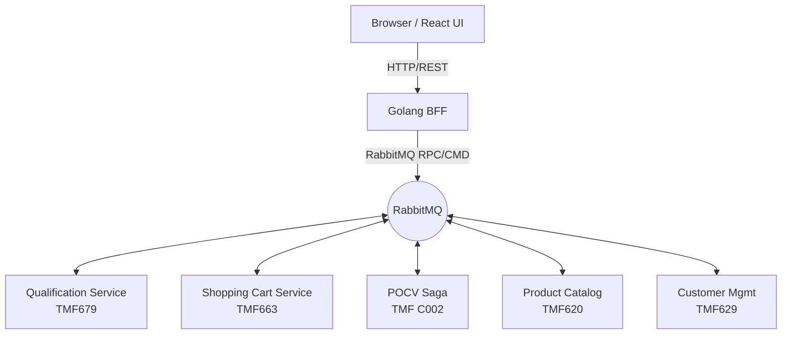

### Existing RabbitMQ Topics (from `pkg/rabbitmq/topics.go`)

| Topic | Direction | Owner |
|:------|:----------|:------|
| `cmd.qual.eligibility.check` | BFF → Qualification | BFF sends, Qual consumes |
| `query.qual.session.get` | Cart/BFF → Qualification | RPC for session lookup |
| `cmd.cart.item.add` | BFF → Cart | Add item with session pricing |
| `cmd.order.checkout.submit` | BFF → POCV | Start the saga |
| `evt.cart.session.updated` | Cart → * | Cart changed |
| `evt.inventory.resource.reserved` | Inventory → POCV | Saga step |
| `evt.payment.transaction.authorized` | Payment → POCV | Saga step |
| `evt.order.management.created` | OrderMgmt → POCV | Saga complete |

---

## 1. Use Case: UC-01 — Search Offerings via Qualification (TMF679)

### 1.1 Description

The customer enters a service address. The UI sends a qualification request to the BFF, which forwards it as a command to the **Qualification Service (TMF679)**. The service performs a scatter-gather across GIS (coverage polygon), Inventory (free ports), and Catalog (eligible offerings), then calculates customer-specific prices. The result — a `QualificationSession` — is persisted for 24 hours and its ID is returned to the UI so offerings can be displayed with locked-in prices.

### 1.2 Actors

| Actor | Role |
|:------|:-----|
| Customer | Enters service address and customer context |
| React UI | Renders address form, loading states, and result cards |
| Golang BFF | Translates POST → RabbitMQ RPC |
| Qualification Service | Scatter-gather, eligibility evaluation, session persistence |
| GIS Service | Coverage polygon check |
| Inventory Service | Port capacity check |
| Product Catalog | Returns available offerings for the eligible category |
| Customer Management | Returns customer tier for pricing |

### 1.3 Preconditions

- Customer must be authenticated and have a `customerId`.
- A valid `categoryFilter` can optionally be provided (defaults to `"Fiber"`).
- The address must have `street`, `number`, `city`, `zip` fields.

### 1.4 Postconditions

- **Success**: `QualificationSession` created with 24-hour TTL. UI receives `sessionId` + list of `QualifiedOffers` each with `offeringId`, `offeringName`, `price {amount, currency, taxIncluded}`, and `eligibility`.
- **Unqualified**: Address outside service area or no capacity. UI shows reason.
- **Error**: Dependency failure. UI shows retry prompt.

### 1.5 Business Rules

- If `customerId` is missing, session is created without customer-specific pricing (base price).
- A `QualifiedOffer.eligibility` of anything other than `"QUALIFIED"` must prevent adding to cart.
- Session expires after 24 hours; the UI must handle `expired` states gracefully.
- Price shown during qualification **must** match price used in cart (legal requirement, guaranteed by session).
- Only offerings from the eligible category are returned (filtering done inside Qualification service).

### 1.6 State Diagram

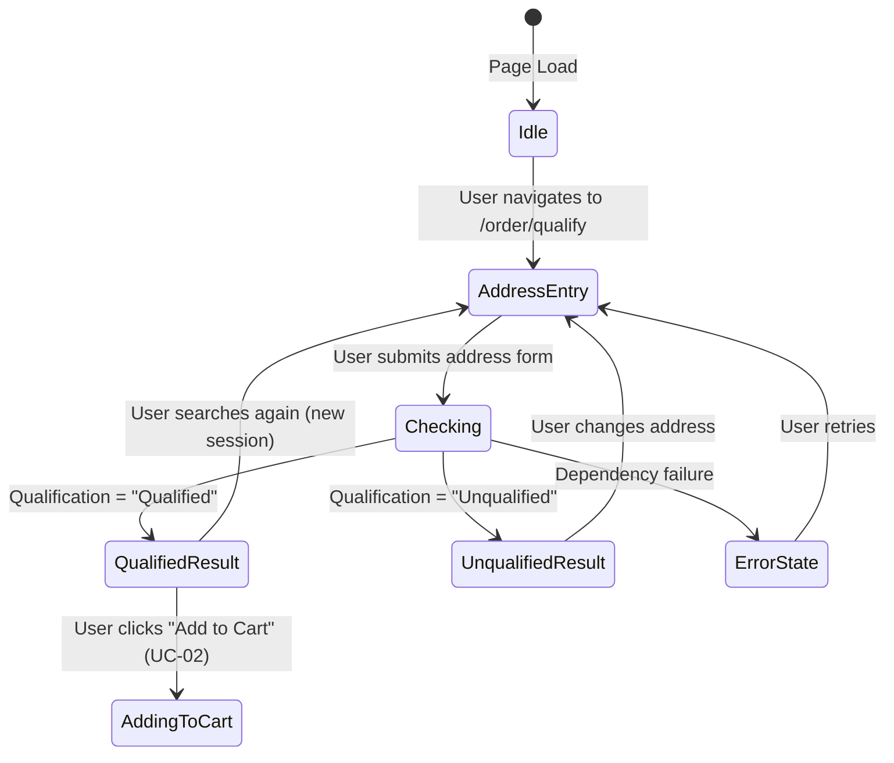

### 1.7 Sequence Diagram

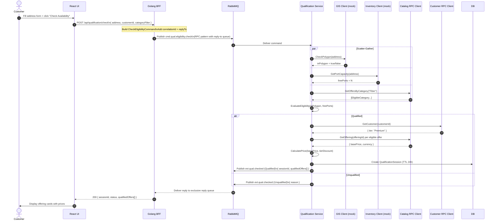

### 1.8 Activity Diagram

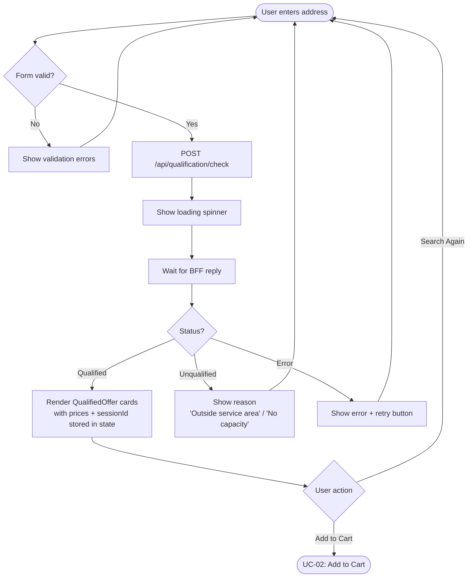

### 1.9 BFF Implementation Requirements

**New BFF Endpoint**: `POST /api/qualification/check`

```
Request Body:
{
  "address": { "street": "string", "number": "string", "city": "string", "zip": "string" },
  "customerId": "string",
  "categoryFilter": ["string"]  // optional, defaults to ["Fiber"]
}

Response 200:
{
  "sessionId": "uuid",
  "status": "Qualified" | "Unqualified" | "Error",
  "qualifiedOffers": [
    {
      "offeringId": "string",
      "offeringName": "string",
      "price": { "amount": 0.0, "currency": "EUR", "taxIncluded": false },
      "eligibility": "QUALIFIED",
      "constraints": ["string"]
    }
  ],
  "unavailabilityReason": "string"
}
```

**BFF Handler Pattern**: Uses existing `RPCClient.CallRPC()` pattern (same as catalog handlers).
- Exchange: `"ex.domain.market"` (or qualification-specific exchange — verify with QUAL service config)
- Routing Key: `cmd.qual.eligibility.check`
- Headers: pass-through auth headers from request
- Timeout: 30 seconds (qualification is async scatter-gather — longer than catalog 10s)

**New BFF Endpoint**: `GET /api/qualification/session/{sessionId}`

Maps to `query.qual.session.get` RPC. Returns `QualificationSession` for display/reuse.

### 1.10 UI Implementation Requirements

**New Route**: `/order/qualify`

**New Feature Directory**: `services/demo-ui/ui/src/features/ordering/`

**Components**:

| Component | Description |
|:----------|:------------|
| `AddressForm` | Controlled form with `street`, `number`, `city`, `zip`. Validates required fields before submit. |
| `QualificationResultPanel` | Conditional render: Loading / Qualified offers / Unqualified message / Error |
| `OfferingCard` | Displays `offeringName`, `price.amount` + `price.currency`, `eligibility` badge. "Add to Cart" button. |
| `SessionExpiryBanner` | Shows countdown/warning when session < 1h from expiry |

**State Management**:
- `qualificationSessionId` stored in React state (or URL search param for shareability)
- `qualifiedOffers[]` stored in TanStack Query cache (`['qualification', sessionId]`)
- Re-check triggers new session; old session discarded

**TypeScript Types**:
```typescript
interface QualificationRequest {
  address: { street: string; number: string; city: string; zip: string };
  customerId: string;
  categoryFilter?: string[];
}

interface QualifiedOffer {
  offeringId: string;
  offeringName: string;
  price: { amount: number; currency: string; taxIncluded: boolean };
  eligibility: 'QUALIFIED' | 'NOT_AVAILABLE';
  constraints?: string[];
}

interface QualificationResult {
  sessionId: string;
  status: 'Qualified' | 'Unqualified' | 'Error';
  qualifiedOffers: QualifiedOffer[];
  unavailabilityReason?: string;
}
```

**Debug View Additions**:

| Type | Topic |
|:-----|:------|
| Command | `cmd.qual.eligibility.check` |
| Event | `evt.qual.checked` |
| Query | `query.qual.session.get` |

---

## 2. Use Case: UC-02 — Add to Shopping Cart (TMF663)

### 2.1 Description

After receiving qualified offerings from UC-01, the customer selects an offering and adds it to their shopping cart. The UI sends an "add item" command to the BFF, which publishes `cmd.cart.item.add` with the `qualificationSessionId`. The Shopping Cart service validates eligibility against the qualification session (via RPC to Qualification service), uses the session's locked price, persists the cart item, and emits `evt.cart.session.updated`. The UI then reflects the updated cart.

### 2.2 Actors

| Actor | Role |
|:------|:-----|
| Customer | Clicks "Add to Cart" on an offering card |
| React UI | Manages cart state, shows feedback |
| Golang BFF | Translates REST → RabbitMQ command |
| Shopping Cart Service | Validates session, locks price, persists item |
| Qualification Service | RPC server for `query.qual.session.get` |

### 2.3 Preconditions

- UC-01 has been completed: a valid, non-expired `QualificationSession` exists.
- `offeringId` must be in the session's `QualifiedOffers` with `eligibility = "QUALIFIED"`.
- Customer has a `customerId` (from auth context).

### 2.4 Postconditions

- **Success**: Cart item created with price from qualification session. Cart `version` incremented. `evt.cart.session.updated` published.
- **Session Expired**: Error returned. UI prompts re-qualification.
- **Offering Not Eligible**: Error returned. UI shows "offering not available for your location".
- **Cart Not Found**: New cart created automatically (Cart service creates on first add).

### 2.5 Business Rules

- The cart `AddItem` use case **must** receive `qualificationSessionId` to validate eligibility and use session price (legal requirement — price consistency).
- If `qualificationSessionId` is absent, fallback to internal price lookup (legacy path — not preferred for ordering flow).
- Multiple offerings from the same session can be added to the same cart.
- Cart `status` must be `"Active"` to accept new items.
- Quantity defaults to `1` but must be validated `> 0`.
- Same offering can appear multiple times with different `productConfig` (identified by UUID, not offeringId).

### 2.6 Validations Supported by Backend

From `manage_items.go` and `qualification_client.go`:

| Validation | Where Enforced | Error |
|:-----------|:---------------|:------|
| Session exists | `qualClient.GetSession()` | "failed to get qualification session" |
| Session not expired | `QualificationClient.GetSession()` + `RPCHandler.HandleGetSession()` | "qualification session has expired" |
| Offering in session | `session.GetOfferingPrice(offeringId)` | "offering X not found in qualification session" |
| Offering is eligible | `offering.Eligible == "QUALIFIED"` | "offering X is not eligible in this session" |
| Cart is Active | implicit (new cart created if not found) | — |

### 2.7 State Diagram

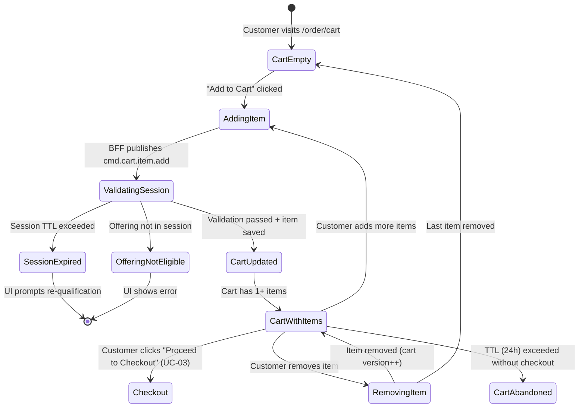

### 2.8 Sequence Diagram

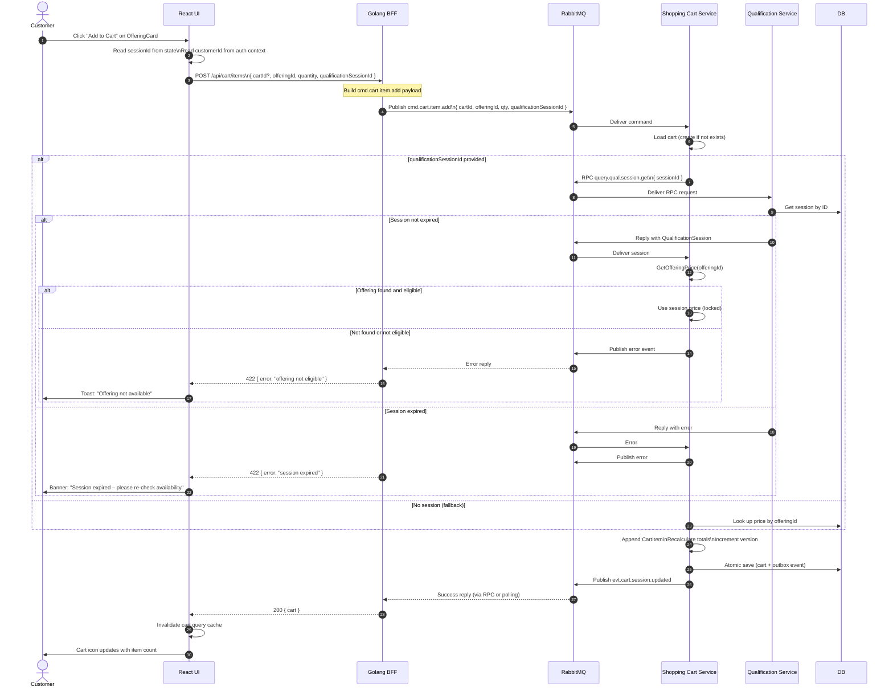

### 2.9 Activity Diagram

```mermaid
flowchart TD
    Start([Offering Card: "Add to Cart" clicked]) --> HasSession{sessionId in state?}
    HasSession -->|No| PromptRequalify[Show: 'Please check availability first']
    HasSession -->|Yes| PostItem[POST /api/cart/items]
    PostItem --> ShowItemLoader[Disable button + spinner]
    ShowItemLoader --> WaitResponse[Await BFF response]
    WaitResponse --> ResponseCheck{HTTP status?}
    ResponseCheck -->|200 OK| UpdateCartState[Update cart badge\nShow success toast]
    ResponseCheck -->|422 Session Expired| ShowExpiredBanner[Banner: 'Session expired'\nOffer re-qualification link]
    ResponseCheck -->|422 Not Eligible| ShowEligibilityError[Toast: 'Not available at your address']
    ResponseCheck -->|5xx| ShowGenericError[Toast: 'Failed to add item – try again']
    UpdateCartState --> ViewCart{View cart?}
    ViewCart -->|Yes| NavigateCart[Navigate to /order/cart]
    ViewCart -->|No| End([Continue browsing])
```

### 2.10 BFF Implementation Requirements

**New BFF Endpoint**: `POST /api/cart/items`

```
Request Body:
{
  "cartId": "string",             // optional: omit to let service create/auto-assign
  "offeringId": "string",         // required
  "quantity": 1,                  // required, > 0
  "qualificationSessionId": "string"  // required for ordering flow
}

Response 200:
{
  "cartId": "string",
  "items": [...],
  "totalPriceAmount": 0.0,
  "totalPriceCurrency": "EUR",
  "version": 2
}

Response 422:
{
  "error": "session expired" | "offering not eligible" | "offering not found in session"
}
```

**BFF Handler**: Publishes `cmd.cart.item.add` as an **RPC command** to get back an updated cart or error.
- Exchange: `"ex.domain.market"` (cart service exchange)
- Routing Key: `cmd.cart.item.add`
- Timeout: 15 seconds

**New BFF Endpoint**: `GET /api/cart/{cartId}`
- RPC to `query.cart.get` (Shopping Cart `HandleGetCart` already supports this via `query.cart.get` routing pattern)
- Returns current cart state

**New BFF Endpoint**: `DELETE /api/cart/{cartId}/items/{itemId}`
- RPC to `cmd.cart.item.remove` (needs implementation in Cart service)

### 2.11 UI Implementation Requirements

**New Route**: `/order/cart`

**Components**:

| Component | Description |
|:----------|:------------|
| `CartPage` | Full cart view: items list + totals + "Proceed to Checkout" button |
| `CartItem` row | Shows offering name, price, quantity, remove button |
| `CartSummary` | Total amount, currency, item count |
| `SessionExpiryGuard` | Checks session TTL before allowing "Checkout"; shows warning if < 30 min |
| `CartBadge` (in nav) | Global cart item count indicator |

**State Management**:
- Cart state managed by TanStack Query (`['cart', cartId]`) with `refetchOnWindowFocus`
- `cartId` persisted in `localStorage` (survives page refresh)
- `qualificationSessionId` linked to cart in UI state

**TypeScript Types**:
```typescript
interface CartItem {
  id: string;
  offeringId: string;
  offeringName?: string;  // joined from catalog on display
  quantity: number;
  price: { amount: number; currency: string };
}

interface Cart {
  id: string;
  customerId: string;
  status: 'Active' | 'Pricing' | 'Closed' | 'Abandoned';
  items: CartItem[];
  totalPriceAmount: number;
  totalPriceCurrency: string;
  version: number;
  validForEnd: string; // ISO date
}

interface AddCartItemRequest {
  cartId?: string;
  offeringId: string;
  quantity: number;
  qualificationSessionId: string;
}
```

**Debug View Additions**:

| Type | Topic |
|:-----|:------|
| Command | `cmd.cart.item.add` |
| Query | `query.cart.get` |
| Event | `evt.cart.session.updated` |

---

## 3. Use Case: UC-03 — Place Product Order (POCV Saga)

### 3.1 Description

After reviewing the cart, the customer clicks "Place Order". The UI sends a checkout command to the BFF, which publishes `cmd.order.checkout.submit` to the **POCV Saga Orchestrator**. The Saga creates a `SagaInstance`, snapshots the cart, and drives a compensating transaction across Inventory reservation → Payment authorization → Product Order creation. The UI polls for Saga status (or receives WebSocket push events) and shows progress. On completion, an order confirmation is displayed.

### 3.2 Actors

| Actor | Role |
|:------|:-----|
| Customer | Confirms order on checkout page |
| React UI | Shows checkout wizard, order status, confirmation |
| Golang BFF | Publishes checkout command; exposes order status endpoint |
| POCV Service | Saga orchestrator |
| Shopping Cart | Source of truth for cart contents |
| Inventory Service | Reserves stock (mocked) |
| Payment Service | Authorizes payment (mocked with `tok_visa_mock`) |
| Product Order Mgmt | Creates final order record |

### 3.3 Preconditions

- Cart must be in `"Active"` status with at least one item.
- `customerId` is known (from auth context).
- Qualification session is still valid (or UI warns before proceeding).

### 3.4 Postconditions

- **Happy Path**: Saga reaches `COMPLETED`. An order record is created. Cart transitions to `Closed`. Customer shown confirmation.
- **Inventory Failed**: Saga transitions to `FAILED`. Cart remains modifiable. UI shows reason.
- **Payment Declined**: Saga transitions to `COMPENSATING` → releases inventory → `FAILED`. UI shows payment failure.
- **Timeout**: Saga stuck `> N minutes` triggers timeout/compensation (backend monitor).

### 3.5 Business Rules

- Idempotency: If customer clicks "Place Order" twice with same `cartId`, POCV detects existing Saga and returns current status (no double order).
- Cart snapshot taken at Saga start — subsequent cart changes do NOT affect the ongoing Saga.
- Cart is set to `"Closed"` (or locked) upon Saga creation.
- The UI must show real-time Saga progression (Inventory → Payment → Order Created).
- Compensation steps are transparent to the user (they see failure reason, not internals).

### 3.6 Saga State Machine

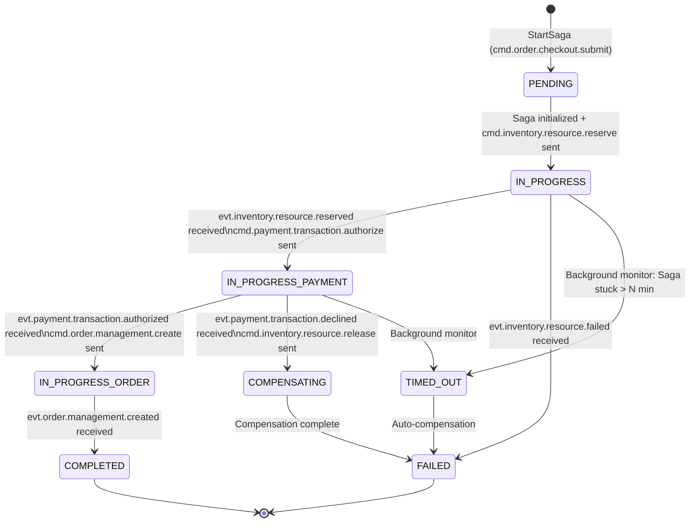

*Note: The existing `domain/saga.go` defines `PENDING`, `IN_PROGRESS`, `COMPLETED`, `FAILED`, `COMPENSATING`. `TIMED_OUT` is a planned extension per POCV analysis.*

### 3.7 Sequence Diagram

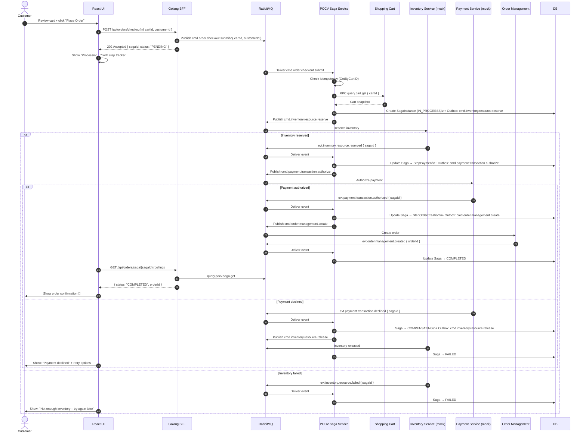

### 3.8 Activity Diagram

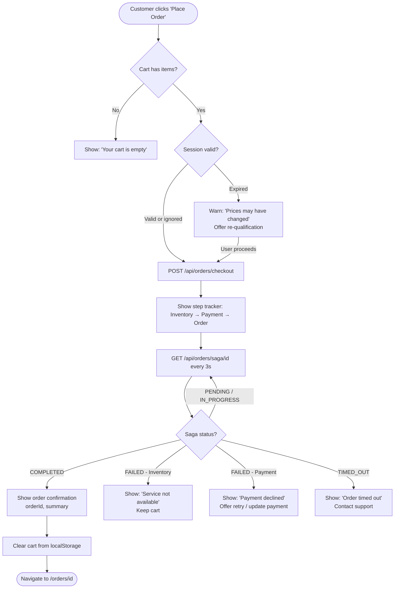

### 3.9 BFF Implementation Requirements

**New BFF Endpoint**: `POST /api/orders/checkout`

```
Request Body:
{
  "cartId": "string",
  "customerId": "string"
}

Response 202:
{
  "sagaId": "string",
  "status": "PENDING",
  "cartId": "string"
}
```

- Publishes `cmd.order.checkout.submit` as a **fire-and-forget command** (no RPC reply needed for submission).
- Returns `202 Accepted` immediately after publishing.
- The `sagaId` is generated by the BFF (UUID) and included in the message headers so POCV can use it — or the BFF polls for the saga created for this `cartId`.

**New BFF Endpoint**: `GET /api/orders/saga/{sagaId}`

```
Response 200:
{
  "sagaId": "string",
  "cartId": "string",
  "status": "PENDING" | "IN_PROGRESS" | "COMPLETED" | "FAILED" | "COMPENSATING",
  "currentStep": "INIT" | "INVENTORY" | "PAYMENT" | "ORDER_CREATION",
  "orderId": "string",  // populated when COMPLETED
  "failureReason": "string"  // populated when FAILED
}
```

- RPC to `query.pocv.saga.get` (needs to be added to POCV service's RPC handler).

**New BFF Endpoint** (optional, alternative to polling): WebSocket push
- POCV publishes `evt.pocv.saga.updated` on each Saga state transition.
- BFF Debug Consumer subscribes and forwards to `/ws/debug`.
- UI can use the existing WebSocket debug channel to detect saga completion.

### 3.10 UI Implementation Requirements

**New Routes**:

| Route | Page | Description |
|:------|:-----|:------------|
| `/order/checkout` | `CheckoutPage` | Order review + confirmation step |
| `/order/confirmation/:orderId` | `OrderConfirmationPage` | Success screen |
| `/order/status/:sagaId` | `OrderStatusPage` | Polling status tracker |

**Components**:

| Component | Description |
|:----------|:------------|
| `CheckoutPage` | Summary of cart items, total price, customer info. "Place Order" CTA. |
| `OrderStepTracker` | Visual step progress: Inventory → Payment → Order Created. Shows current step from saga status. |
| `OrderConfirmationPage` | Order ID, summary, "Go to Dashboard" button. |
| `SessionExpiryWarning` | Dialog warning if qualification session expired before checkout. |
| `PaymentDeclinedPanel` | Friendly error with "Update Payment" action (mock: no actual payment form yet). |

**Polling Logic** (using TanStack Query):
```typescript
useQuery({
  queryKey: ['saga', sagaId],
  queryFn: () => fetchSagaStatus(sagaId),
  refetchInterval: (data) =>
    data?.status === 'COMPLETED' || data?.status === 'FAILED' ? false : 3000,
  enabled: !!sagaId,
});
```

**TypeScript Types**:
```typescript
type SagaStatus = 'PENDING' | 'IN_PROGRESS' | 'COMPLETED' | 'FAILED' | 'COMPENSATING' | 'TIMED_OUT';
type SagaStep = 'INIT' | 'INVENTORY' | 'PAYMENT' | 'ORDER_CREATION';

interface SagaStatusResponse {
  sagaId: string;
  cartId: string;
  status: SagaStatus;
  currentStep: SagaStep;
  orderId?: string;
  failureReason?: string;
  createdAt: string;
  updatedAt: string;
}

interface CheckoutRequest {
  cartId: string;
  customerId: string;
}

interface CheckoutResponse {
  sagaId: string;
  status: 'PENDING';
  cartId: string;
}
```

**Debug View Additions**:

| Type | Topic |
|:-----|:------|
| Command | `cmd.order.checkout.submit` |
| Query | `query.pocv.saga.get` |
| Event | `evt.inventory.resource.reserved` |
| Event | `evt.payment.transaction.authorized` |
| Event | `evt.order.management.created` |

---

## 4. Cross-Cutting Concerns

### 4.1 Navigation Flow

The three use cases form a linear wizard-like flow:

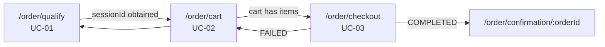

**Navigation guard**: Each step should guard against missing state:
- `/order/cart` requires `cartId` (in localStorage or URL param).
- `/order/checkout` requires cart to be non-empty.
- `/order/status/:sagaId` requires `sagaId`.

### 4.2 Left Navigation Updates

Add an "Ordering" section to the sidebar:

```
Ordering
  ├── Check Availability       /order/qualify
  ├── Shopping Cart            /order/cart
  └── My Orders                /orders  (future)
```

### 4.3 Error Handling

All BFF endpoints must return structured JSON errors:
```json
{ "error": "human-readable string", "code": "MACHINE_CODE" }
```

UI error codes to handle:

| Code | Scenario | UI Action |
|:-----|:---------|:----------|
| `SESSION_EXPIRED` | Qualification session TTL exceeded | Show banner + re-qualify link |
| `OFFERING_NOT_ELIGIBLE` | Offering not in session | Toast error |
| `OFFERING_NOT_IN_SESSION` | Session doesn't contain offering | Toast error |
| `CART_INACTIVE` | Cart closed or abandoned | Prompt new session |
| `SAGA_IDEMPOTENT` | Double checkout | Return existing saga status |
| `DEPENDENCY_FAILURE` | Backend scatter-gather failed | Show retry + support info |

### 4.4 Session Lifecycle

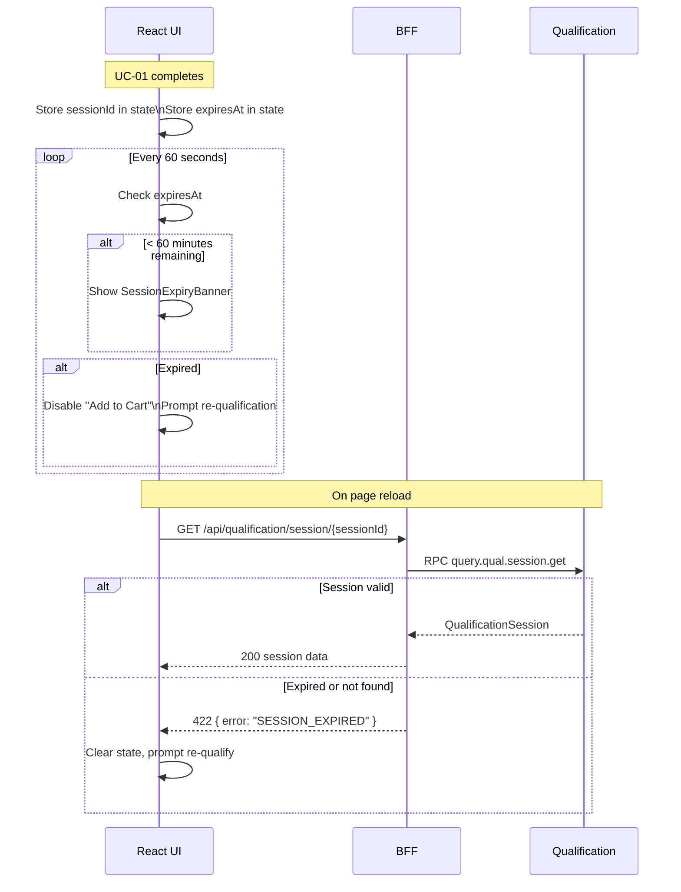

### 4.5 RabbitMQ Topic Summary for Ordering Flow

| Topic | Type | Publisher | Consumer |
|:------|:-----|:----------|:---------|
| `cmd.qual.eligibility.check` | Command (RPC) | BFF | Qualification |
| `evt.qual.checked` | Event / RPC Reply | Qualification | BFF |
| `query.qual.session.get` | Query (RPC) | Cart / BFF | Qualification |
| `cmd.cart.item.add` | Command (RPC) | BFF | Cart |
| `query.cart.get` | Query (RPC) | BFF / POCV | Cart |
| `evt.cart.session.updated` | Event | Cart | Debug / POCV |
| `cmd.order.checkout.submit` | Command | BFF | POCV |
| `cmd.inventory.resource.reserve` | Command | POCV | Inventory |
| `evt.inventory.resource.reserved` | Event | Inventory | POCV |
| `evt.inventory.resource.failed` | Event | Inventory | POCV |
| `cmd.payment.transaction.authorize` | Command | POCV | Payment |
| `evt.payment.transaction.authorized` | Event | Payment | POCV |
| `evt.payment.transaction.declined` | Event | Payment | POCV |
| `cmd.inventory.resource.release` | Command | POCV | Inventory |
| `cmd.order.management.create` | Command | POCV | Order Mgmt |
| `evt.order.management.created` | Event | Order Mgmt | POCV |
| `query.pocv.saga.get` | Query (RPC, NEW) | BFF | POCV |

### 4.6 BFF Route Summary

| Method | Path | UC | Maps To |
|:-------|:-----|:---|:--------|
| POST | `/api/qualification/check` | UC-01 | `cmd.qual.eligibility.check` (RPC) |
| GET | `/api/qualification/session/{id}` | UC-01 | `query.qual.session.get` (RPC) |
| POST | `/api/cart/items` | UC-02 | `cmd.cart.item.add` (RPC) |
| GET | `/api/cart/{cartId}` | UC-02 | `query.cart.get` (RPC) |
| DELETE | `/api/cart/{cartId}/items/{itemId}` | UC-02 | `cmd.cart.item.remove` (CMD) |
| POST | `/api/orders/checkout` | UC-03 | `cmd.order.checkout.submit` (CMD fire-and-forget) |
| GET | `/api/orders/saga/{sagaId}` | UC-03 | `query.pocv.saga.get` (RPC, NEW) |

### 4.7 UI Page Map Update

| Page | Route | Use Case |
|:-----|:------|:---------|
| Qualification / Availability Check | `/order/qualify` | UC-01 |
| Shopping Cart | `/order/cart` | UC-02 |
| Checkout | `/order/checkout` | UC-03 |
| Order Status | `/order/status/:sagaId` | UC-03 |
| Order Confirmation | `/order/confirmation/:orderId` | UC-03 |

---

## 5. Architecture Compliance

All new BFF handlers must follow the existing pattern established in `catalog_handlers.go`:
- Use `RPCClient.CallRPC(ctx, exchange, routingKey, payload, headers)`.
- Set timeout context: 30s for qualification, 15s for cart, 30s for saga status.
- Return structured JSON errors on failure.
- No business logic in BFF handlers — they are pure translators.

All new UI features must follow the existing pattern in `features/catalog/`:
- `api.ts`: TanStack Query hooks wrapping `apiClient`.
- `types.ts`: TypeScript interfaces.
- Components use `screen.getByRole()` in tests (per ARCHITECTURE.md testing standards).
- Feature directory: `features/ordering/` with sub-directories per page.

---

## 6. Gap Analysis

### 6.1 Gaps in Backend (need implementation)

| Gap | Service | Priority | Description |
|:----|:--------|:---------|:------------|
| `query.pocv.saga.get` RPC handler | POCV | **HIGH** | Required for BFF to poll saga status |
| `cmd.cart.item.remove` handler | Shopping Cart | MEDIUM | Allows item removal from cart |
| `query.cart.get` RPC routing registration | Cart | **HIGH** | Verify routing key `query.cart.get` is registered in Consumer |
| `evt.pocv.saga.updated` event publication | POCV | MEDIUM | For WebSocket push instead of polling |
| Qualification exchange name | Qualification | **HIGH** | Confirm exchange name for `cmd.qual.eligibility.check` |

### 6.2 Gaps in BFF (need implementation)

| Gap | Priority | Description |
|:----|:---------|:------------|
| `POST /api/qualification/check` handler | **HIGH** | UC-01 entry point |
| `GET /api/qualification/session/{id}` handler | **HIGH** | Session reuse / validation |
| `POST /api/cart/items` handler | **HIGH** | UC-02 entry point |
| `GET /api/cart/{cartId}` handler | **HIGH** | Cart view |
| `DELETE /api/cart/{cartId}/items/{itemId}` handler | MEDIUM | Cart management |
| `POST /api/orders/checkout` handler | **HIGH** | UC-03 entry point |
| `GET /api/orders/saga/{sagaId}` handler | **HIGH** | Saga status polling |
| Ordering topic constants | **HIGH** | Add to BFF constants (mirror `pkg/rabbitmq/topics.go`) |

### 6.3 Gaps in UI (need implementation)

| Gap | Priority | Description |
|:----|:---------|:------------|
| `features/ordering/` feature directory | **HIGH** | All new ordering components |
| Qualification address form | **HIGH** | UC-01 entry |
| Offering cards with prices | **HIGH** | UC-01 results |
| Cart page | **HIGH** | UC-02 |
| Checkout page | **HIGH** | UC-03 |
| Order status polling | **HIGH** | UC-03 |
| Order confirmation page | HIGH | UC-03 success |
| Sidebar navigation for Ordering | HIGH | Discoverability |
| Session expiry tracking | MEDIUM | User experience |
| Cart badge in nav header | MEDIUM | Cart awareness |

---

## 7. GitHub Issues

The following issues should be created to implement the ordering mechanism.

---

### Issue 1 — [BFF] Add Qualification Check endpoint (UC-01)

**Title**: `[BFF] Implement POST /api/qualification/check – forward to Qualification Service (TMF679)`

**Labels**: `bff`, `qualification`, `uc-01`, `ordering`

**Description**:

Add a new BFF HTTP handler that accepts a qualification check request from the UI and forwards it as an RPC command to the Qualification Service.

**Acceptance Criteria**:
- `POST /api/qualification/check` accepts `{ address, customerId, categoryFilter }`.
- BFF publishes `cmd.qual.eligibility.check` with correct payload and reply-to queue.
- BFF waits for reply on exclusive reply queue (timeout: 30s).
- Returns `200` with `{ sessionId, status, qualifiedOffers[] }` on success.
- Returns `504` on timeout, `500` on dependency error.
- Unit tests for handler covering success and timeout scenarios.
- Exchange and routing key added as BFF constants.

---

### Issue 2 — [BFF] Add Qualification Session retrieval endpoint (UC-01)

**Title**: `[BFF] Implement GET /api/qualification/session/{sessionId} – RPC to Qualification Service`

**Labels**: `bff`, `qualification`, `uc-01`, `ordering`

**Description**:

The UI needs to validate or re-load a qualification session (e.g., on page refresh). This endpoint maps to the existing `query.qual.session.get` RPC.

**Acceptance Criteria**:
- `GET /api/qualification/session/{sessionId}` proxies to `query.qual.session.get`.
- Returns full `QualificationSession` including `qualifiedOffers[]` and `expiresAt`.
- Returns `422` with `{ error: "SESSION_EXPIRED" }` when session is past TTL.
- Unit tests for handler.

---

### Issue 3 — [BFF] Add Cart management endpoints (UC-02)

**Title**: `[BFF] Implement Cart endpoints – POST /api/cart/items, GET /api/cart/{id}, DELETE /api/cart/{id}/items/{itemId}`

**Labels**: `bff`, `shopping-cart`, `uc-02`, `ordering`

**Description**:

Expose cart operations to the UI via BFF. Uses `cmd.cart.item.add` and `query.cart.get` RabbitMQ topics.

**Acceptance Criteria**:
- `POST /api/cart/items` publishes `cmd.cart.item.add` with `{ cartId, offeringId, quantity, qualificationSessionId }`.
- `GET /api/cart/{cartId}` calls `query.cart.get` RPC and returns cart state.
- `DELETE /api/cart/{cartId}/items/{itemId}` publishes `cmd.cart.item.remove` (fire-and-forget).
- Proper error propagation for `SESSION_EXPIRED`, `OFFERING_NOT_ELIGIBLE` etc.
- Unit tests for all three handlers.

---

### Issue 4 — [BFF] Add Order Checkout endpoints (UC-03)

**Title**: `[BFF] Implement POST /api/orders/checkout + GET /api/orders/saga/{sagaId}`

**Labels**: `bff`, `pocv`, `uc-03`, `ordering`

**Description**:

The BFF needs to initiate the POCV Saga and expose a status polling endpoint.

**Acceptance Criteria**:
- `POST /api/orders/checkout` publishes `cmd.order.checkout.submit` as a fire-and-forget command.
- Returns `202 Accepted` with `{ sagaId, status: "PENDING", cartId }`.
- `GET /api/orders/saga/{sagaId}` polls POCV via `query.pocv.saga.get` RPC.
- Returns `SagaStatusResponse` with `status`, `currentStep`, `orderId`, `failureReason`.
- Unit tests for both handlers.

---

### Issue 5 — [Backend] Add `query.pocv.saga.get` RPC handler to POCV (UC-03)

**Title**: `[POCV] Implement RPC handler for query.pocv.saga.get – Saga status query`

**Labels**: `backend`, `pocv`, `uc-03`, `ordering`

**Description**:

The BFF needs to query Saga status by `sagaId`. POCV must expose a query RPC handler similar to how the Qualification service exposes `query.qual.session.get`.

**Acceptance Criteria**:
- New `RPCHandler` in POCV `adapter/handler/` that handles `query.pocv.saga.get`.
- Input: `{ sagaId: "string" }`.
- Output: `SagaInstance` JSON with `id`, `cartId`, `status`, `currentStep`, `payload`, `updatedAt`.
- If saga not found, return `{ error: "saga not found" }`.
- Registered in Consumer in `cmd/server/main.go`.
- Unit tests.

---

### Issue 6 — [UI] Implement Qualification Flow page (UC-01)

**Title**: `[UI] Add /order/qualify page – Address form + Offering results display`

**Labels**: `ui`, `qualification`, `uc-01`, `ordering`

**Description**:

Create the qualification user flow: address input form, loading state, qualified offering cards with prices, and unqualified/error states.

**Acceptance Criteria**:
- Route `/order/qualify` renders `QualifyPage`.
- `AddressForm` component with fields: street, number, city, zip. Submit button.
- Form validation: all fields required.
- On submit: calls `POST /api/qualification/check`, shows loading spinner.
- On success (`Qualified`): renders `OfferingCard` list with `offeringName`, price, currency, "Add to Cart" button.
- On `Unqualified`: shows reason message with option to re-check.
- On error: shows retry button.
- `sessionId` stored in component state.
- TanStack Query hook: `useCheckQualification()`.
- TypeScript types in `features/ordering/types.ts`.
- Unit tests: form validation, success render, error render, unqualified render.

---

### Issue 7 — [UI] Implement Shopping Cart page (UC-02)

**Title**: `[UI] Add /order/cart page – Cart items display, add/remove, proceed to checkout`

**Labels**: `ui`, `shopping-cart`, `uc-02`, `ordering`

**Description**:

Create the shopping cart page, the "Add to Cart" integration from the offering cards, and the checkout CTA.

**Acceptance Criteria**:
- Route `/order/cart` renders `CartPage`.
- Calls `GET /api/cart/{cartId}` on load (cartId from localStorage).
- Displays cart items with offering name, quantity, unit price, total price, remove button.
- Cart badge in nav header showing item count.
- `POST /api/cart/items` called when "Add to Cart" clicked on `OfferingCard` (from UC-01).
- Error handling: session expired banner, not eligible toast.
- `DELETE /api/cart/{cartId}/items/{itemId}` on remove click.
- "Proceed to Checkout" button navigates to `/order/checkout`.
- `cartId` persisted in `localStorage`.
- TanStack Query hooks: `useCart()`, `useAddCartItem()`, `useRemoveCartItem()`.
- Unit tests: empty cart, item list render, add item success, add item session-expired error.

---

### Issue 8 — [UI] Implement Checkout and Order Status flow (UC-03)

**Title**: `[UI] Add /order/checkout, /order/status/:sagaId, /order/confirmation/:orderId pages`

**Labels**: `ui`, `pocv`, `uc-03`, `ordering`

**Description**:

Create the checkout confirmation page, the real-time saga status tracker, and the order confirmation page.

**Acceptance Criteria**:
- Route `/order/checkout` renders `CheckoutPage` with cart summary and "Place Order" button.
- On "Place Order": calls `POST /api/orders/checkout`, navigates to `/order/status/:sagaId`.
- Route `/order/status/:sagaId` renders `OrderStatusPage` with `OrderStepTracker`.
- `OrderStepTracker` shows steps: Inventory, Payment, Order Created. Highlights current step.
- TanStack Query polls `GET /api/orders/saga/{sagaId}` every 3 seconds.
- Polling stops when status is `COMPLETED` or `FAILED`.
- On `COMPLETED`: navigate to `/order/confirmation/:orderId`.
- On `FAILED`: show failure reason + "Modify Cart" link back to `/order/cart`.
- Route `/order/confirmation/:orderId` shows success screen with order ID.
- TanStack Query hook: `useSagaStatus(sagaId)` with `refetchInterval`.
- Unit tests: checkout page render, status polling (COMPLETED), status polling (FAILED).

---

### Issue 9 — [UI] Add Ordering navigation section to sidebar

**Title**: `[UI] Add 'Ordering' navigation section to sidebar with UC-01, UC-02 links`

**Labels**: `ui`, `ordering`, `navigation`

**Description**:

Update the Layout sidebar to include a new "Ordering" section.

**Acceptance Criteria**:
- Sidebar shows section: "Ordering" with:
  - "Check Availability" → `/order/qualify`
  - "Shopping Cart" → `/order/cart`
- Cart link shows item count badge if cart has items.
- Active route highlighted.
- Router updated with new routes.
- Unit tests for navigation rendering.

---

### Issue 10 — [UI+BFF] Add Ordering topics to Debug Console

**Title**: `[UI+BFF] Extend Debug Console with Ordering RabbitMQ topics`

**Labels**: `ui`, `bff`, `debug`, `ordering`

**Description**:

The Debug Console must show all ordering-related messages so the async flow is visible.

**Acceptance Criteria**:
- BFF Debug Consumer subscribes to all ordering topics listed in §4.5.
- Debug Console filter adds: "Ordering" as a service filter option.
- Topics included: `cmd.qual.eligibility.check`, `evt.qual.checked`, `cmd.cart.item.add`, `evt.cart.session.updated`, `cmd.order.checkout.submit`, saga step events.
- Color coding: Commands = Blue, Events = Purple, Queries = Green.

---

*Document version 1.0 — Created 2026-04-19*
*Services covered: Qualification (TMF679), Shopping Cart (TMF663), POCV (TMF C002), Product Catalog (TMF620), Customer Management (TMF629)*
