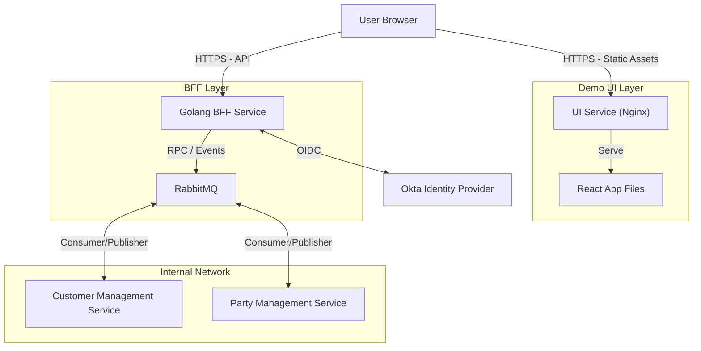

# UI Architecture Document

## 1. Executive Summary
This document outlines the architecture for the `demo-ui` service, a modern web application designed to demonstrate the capabilities of the TMF API microservices. The architecture prioritizes type safety, maintainability, and clean separation of concerns using a Backend-for-Frontend (BFF) pattern.

## 2. Technology Stack

### Frontend
-   **Framework**: React 19 (via Vite)
-   **Language**: TypeScript (Strict Mode)
-   **Build Tool**: Vite
-   **Package Manager**: Yarn 4 (Berry)
-   **State Management**: React Hooks (Reducer, Context) + TanStack Query (v5)
-   **Data Grid**: TanStack Table (v8) + TanStack Virtual (for scrolling performance)
-   **Component Primitives**: Radix UI (Headless, Accessible)
-   **Icons**: Lucide React
-   **Styling**: Vanilla CSS (CSS Modules or utility classes if needed)
-   **Testing**: Vitest (Unit), React Testing Library (Component), Playwright (E2E)

### Backend-for-Frontend (BFF)
-   **Language**: Go (Golang) 1.24+
-   **Framework**: Standard Library (`net/http`) or lightweight router (e.g., `chi` or `gorilla/mux`)
-   **Role**: Proxy, Aggregation, Authentication Handler, Static File Server

### Infrastructure
-   **Containerization**: Docker (Multi-stage builds)
-   **Orchestration**: Docker Compose (Local Development)

### High-Level Architecture



### 3.1 Backend-for-Frontend (BFF) Pattern
The BFF behaves as an API Gateway for the Frontend.
-   **Separation**: The UI and BFF are deployed separately.
    -   **Demo UI Container**: Nginx server hosting the compiled React application.
    -   **BFF Container**: Golang service handling API requests.
-   **Responsibilities**:
    -   **Auth**: BFF handles OAuth2/OIDC. UI redirects to BFF for login.
    -   **RabbitMQ RPC Client**: BFF converts HTTP requests from the UI into RabbitMQ messages.
    -   **CORS**: BFF must allow requests from the UI domain.

## 4. Key Design Decisions

### 4.1 State Management (No Redux/MobX)
-   **Server State (Data Sync)**: usage of **TanStack Query (React Query)**. This handles caching, deduplication, loading states, and refetching logic for all API data.
-   **Client State (UI)**: usage of **React Context + useReducer** for global UI state (e.g., theme, sidebar toggle, toast notifications). Local component state uses `useState`.

### 4.2 Authentication & Authorization
-   **Provider**: Okta.
-   **Flow**: Authorization Code Flow with PKCE.
-   **Implementation**:
    -   The BFF handles the OIDC exchange to keep tokens secure on the server side (Session Cookie pattern recommended for best security).
    -   Alternatively, if Client-Side Auth is preferred, the React app uses `@okta/okta-react`, but the BFF approach is safer.
    -   *Decision*: **BFF-handled Auth** (Session Cookie) is proposed for higher security, but Client-Side Auth is simpler for a "demo". Given the requirement for a Golang BFF, we will leverage it for security.

### 4.3 Testing Strategy
-   **Unit Tests**: Business logic functions (hooks, reducers, utils) tested with **Vitest**.
-   **Component Tests**: Rendered components tested with **React Testing Library**.
-   **Integration/E2E**: Critical user flows tested with **Playwright** against a running stack.
-   **Coverage**: 100% test coverage goal for business logic.

## 5. Folder Structure

```
services/
├── demo-ui/
│   ├── ui/                  # Frontend React App (formerly direct under demo-ui)
│   │   ├── src/
│   │   ├── Dockerfile
│   │   └── package.json
│   │
│   └── bff/                 # Golang API Gateway/BFF
│       ├── cmd/server/
│       ├── internal/
│       ├── go.mod
│       └── Dockerfile
```

## 6. Implementation Plan - Next Steps
1.  **Scaffold BFF**: Create `services/demo-bff` with Go.
2.  **Re-scaffold UI**: Re-initialize `services/demo-ui` using the TypeScript template.
3.  **Setup Dev Environment**: Configure `docker-compose` to run BFF + UI + Backends.
