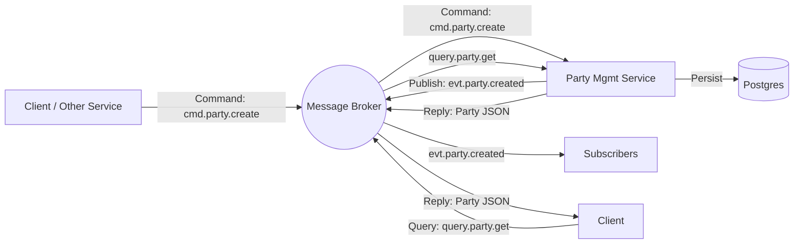

# Architecture: Asynchronous Party Management

## Overview
This document defines the architecture for the Party Management service, adhering to the requirement for **100% Asynchronous Communication**. All interactions (commands, queries, events) will occur via a Message Broker, replacing traditional synchronous REST HTTP endpoints for business logic.

## 1. Communication Pattern
We will use an **Event-Driven Architecture (EDA)** with the following patterns:

### 1.1 Command-Query Responsibility Segregation (CQRS)
*   **Commands (Write)**: Sent as messages to a command topic. The service consumes them, processes the logic, persists state, and emits events.
*   **Events (State Changes)**: Published to an event stream whenever the state changes.
*   **Queries (Read)**: Handled via an **Async Request-Reply** pattern over the message bus (or by consumers building their own read models from the event stream).

### 1.2 Message Topology
We categorize topics/subjects into three types:
*   `cmd.party.<action>`: For requesting an action (e.g., Create, Update).
*   `evt.party.<entity>.<state>`: For broadcasting state changes (e.g., Created, Updated).
*   `query.party.<lookup>`: For retrieving data (e.g., GetById).

## 2. Interface Definition (AsyncAPI)

### 2.1 Commands (Inputs)
| Topic / Subject | Payload Schema | Description |
| :--- | :--- | :--- |
| `cmd.party.create` | `PartyCreateEvent` | Request to register a new individual or organization. |
| `cmd.party.update` | `PartyUpdateEvent` | Request to update attributes of an existing party. |
| `cmd.party.delete` | `PartyDeleteEvent` | Request to remove a party. |

*   **Behavior**: The service acknowledges receipt immediately (ACK), but processing is asynchronous.
*   **Outcome**: If successful, an event is emitted. If failed, a `evt.party.error` or specific failure event is emitted.

### 2.2 Events (Outputs)
Adhering to TMF632 Notification patterns:
| Topic / Subject | Payload Schema | Trigger |
| :--- | :--- | :--- |
| `evt.party.created` | `Party` | Successfully created a party. |
| `evt.party.updated` | `Party` | Successfully updated a party. |
| `evt.party.deleted` | `PartyDeleteNotification` | Successfully deleted a party. |
| `evt.party.stateChange` | `PartyStateChange` | Lifecycle state changed (e.g., Active -> Inactive). |

### 2.3 Queries (Async Request-Reply)
To support retrieval without REST:
*   **Queue**: `query.party.get`
*   **Pattern**: RPC (Remote Procedure Call) utilizing `reply_to` and `correlation_id` properties.
*   **Request**: `{"id": "123"}`
*   **Response**: `Party` object JSON.

## 3. Technology Stack Selection
To implement this efficiently in Go:
*   **Message Broker**: **RabbitMQ** (User requirement).
*   **Marshalling**: **JSON**.
*   **Library**: `github.com/rabbitmq/amqp091-go`.

## 4. Internal Component Structure
The service will consist of:
1.  **RabbitMQ Adapter**: Manages connection, channels, and exchanges.
2.  **Router/Dispatcher**: Route messages from queues to specific handlers.
3.  **Service Layer**: Business logic (validation, TMF rules).
4.  **Repository Layer**: PostgreSQL access (using `pgx` or `gorm`).

## 5. Deployment Diagram

