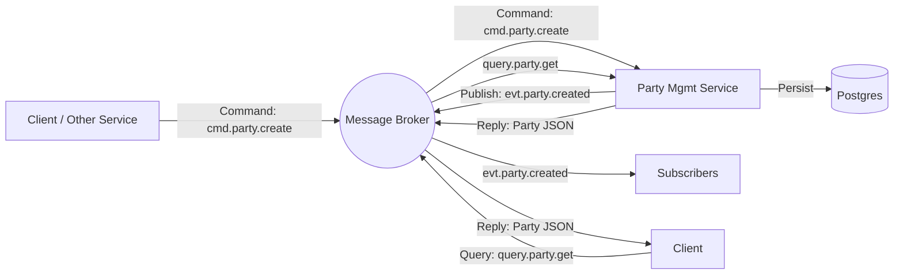

# Architecture: Asynchronous Party Management

## Overview
This document defines the architecture for the Party Management service, adhering to the requirement for **100% Asynchronous Communication**. All interactions (commands, queries, events) will occur via a Message Broker, replacing traditional synchronous REST HTTP endpoints for business logic.

## 1. Core Principles

### 1.1 Context Propagation
**Requirement**: All methods across all layers (Domain, Infrastructure, Transport) MUST accept `context.Context` as their first parameter.

**Rationale**:
- **Timeout Control**: Ensures that long-running database or message broker operations do not hang indefinitely.
- **Cancellation**: Allows the service to stop processing requests if the client disconnects or the system is shutting down.
- **Tracing**: Facilitates distributed tracing (e.g., OpenTelemetry) by carrying trace IDs through the call stack.

**Usage Guidelines**:
- Pass the context received from the listener or HTTP handler all the way down to the repository.
- In `Infrastructure`, always use `db.WithContext(ctx)` for GORM operations or `ch.PublishWithContext(ctx, ...)` for RabbitMQ.
- Use `context.Background()` or `context.TODO()` only at the entry points if a context isn't already available.

### 1.2 Error Handling
- Use domain-specific errors defined in `internal/domain/errors.go`.
- Map infrastructure-specific errors (e.g., `gorm.ErrRecordNotFound`) to domain errors at the boundary.
- Always wrap errors with `%w` to provide context while preserving the original error type for checks.

### 1.3 Resilience
- **RabbitMQ**: Use `ConnectionManager` for automatic reconnection logic.
- **Graceful Shutdown**: Implement `Close()` methods and use `sync.WaitGroup` to ensure all active tasks finish before the process exits.
- **Transactional Outbox**: To ensure data consistency between the database and the message broker, we implement the Transactional Outbox Pattern. Database changes and the corresponding events are persisted in the same transaction. A background worker then reliably publishes these events to RabbitMQ.

### 1.4 Logging
- Use structured logging (`log/slog`) with relevant attributes (e.g., `party_id`) for better observability.

## 2. Communication Pattern
We will use an **Event-Driven Architecture (EDA)** with the following patterns:

### 2.1 Command-Query Responsibility Segregation (CQRS)
*   **Commands (Write)**: Sent as messages to a command topic. The service consumes them, processes the logic, persists state, and emits events.
*   **Events (State Changes)**: Published to an event stream whenever the state changes.
*   **Queries (Read)**: Handled via an **Async Request-Reply** pattern over the message bus (or by consumers building their own read models from the event stream).

### 2.2 Message Topology
We categorize topics/subjects into three types:
*   `cmd.party.<action>`: For requesting an action (e.g., Create, Update).
*   `evt.party.<entity>.<state>`: For broadcasting state changes (e.g., Created, Updated).
*   `query.party.<lookup>`: For retrieving data (e.g., GetById).

### 2.3 Transactional Outbox Pattern
To solve the "dual-write" problem (writing to DB and publishing to Broker atomically), we use an Outbox table:
1.  **Transaction Start**: Begin a database transaction.
2.  **Business Operation**: Create/Update/Delete the domain entity.
3.  **Outbox Record**: Insert an event record into the `outbox_events` table within the **same** transaction.
4.  **Commit**: Commit the transaction. If this fails, neither the entity nor the event is persisted.
5.  **Async Publication**: A background `OutboxWorker` polls the `outbox_events` table for "PENDING" events, publishes them to RabbitMQ, and marks them as "PUBLISHED".

## 3. Interface Definition (AsyncAPI)

### 3.1 Commands (Inputs)
| Topic / Subject | Payload Schema | Description |
| :--- | :--- | :--- |
| `cmd.party.create` | `PartyCreateEvent` | Request to register a new individual or organization. |
| `cmd.party.update` | `PartyUpdateEvent` | Request to update attributes of an existing party. |
| `cmd.party.delete` | `PartyDeleteEvent` | Request to remove a party. |

*   **Behavior**: The service acknowledges receipt immediately (ACK), but processing is asynchronous.
*   **Outcome**: If successful, an event is emitted. If failed, a `evt.party.error` or specific failure event is emitted.

### 3.2 Events (Outputs)
Adhering to TMF632 Notification patterns:
| Topic / Subject | Payload Schema | Trigger |
| :--- | :--- | :--- |
| `evt.party.created` | `Party` | Successfully created a party. |
| `evt.party.updated` | `Party` | Successfully updated a party. |
| `evt.party.deleted` | `PartyDeleteNotification` | Successfully deleted a party. |
| `evt.party.stateChange` | `PartyStateChange` | Lifecycle state changed (e.g., Active -> Inactive). |

### 3.3 Queries (Async Request-Reply)
To support retrieval without REST:
*   **Queue**: `query.party.get`
*   **Pattern**: RPC (Remote Procedure Call) utilizing `reply_to` and `correlation_id` properties.
*   **Request**: `{"id": "123"}`
*   **Response**: `Party` object JSON.

## 4. Technology Stack Selection
To implement this efficiently in Go:
*   **Message Broker**: **RabbitMQ** (User requirement).
*   **Marshalling**: **JSON**.
*   **Library**: `github.com/rabbitmq/amqp091-go`.

## 5. Internal Component Structure
The service will consist of:
1.  **RabbitMQ Adapter**: Manages connection, channels, and exchanges.
2.  **Router/Dispatcher**: Route messages from queues to specific handlers.
3.  **Service Layer**: Business logic (validation, TMF rules).
4.  **Repository Layer**: PostgreSQL access (using `pgx` or `gorm`) with Transaction management.
5.  **Outbox Worker**: Background worker for publishing events.

## 6. Deployment Diagram

## 7. Security & Best Practices

### 7.1 Database Security (Anti-Injection)
When implementing dynamic search or filtering, we strictly prohibit string interpolation for SQL identifiers (column names, table names).

**The "Safe Dynamic Query" Pattern**:
To prevent **Identifier Injection**, we use an explicit `switch` statement that maps input keys to hardcoded SQL strings.

```go
// SAFE PATTERN: Explicit Key Lookup
// We iterate over *known* keys, or check for them explicitly. 
// Unknown keys in the input map are simply ignored.
if val, ok := criteria["id"]; ok {
    query = query.Where("id = ?", val)
}
if val, ok := criteria["type"]; ok {
    query = query.Where("type = ?", val)
}
```

**Rationale**:
- Standard SQL parameterization (`?`) only protects **values**.
- Using `fmt.Sprintf("%s = ?", key)` is dangerous even with an allow-list, as it still allows dynamic construction of the query structure.
- Hardcoded strings in `switch` cases ensure only developer-vetted identifiers can ever reach the database.

### 7.2 Audit Logging
All database modifications MUST be traceable to a user identity.
- **Identity Propagation**: User identity is extracted from RabbitMQ headers (`user` field) and injected into the Go `context`.
- **Session Attribution**: The Repository layer MUST use `set_config('app.current_user', userID, true)` within the transaction to propagate the identity to the PostgreSQL session for audit triggers.
