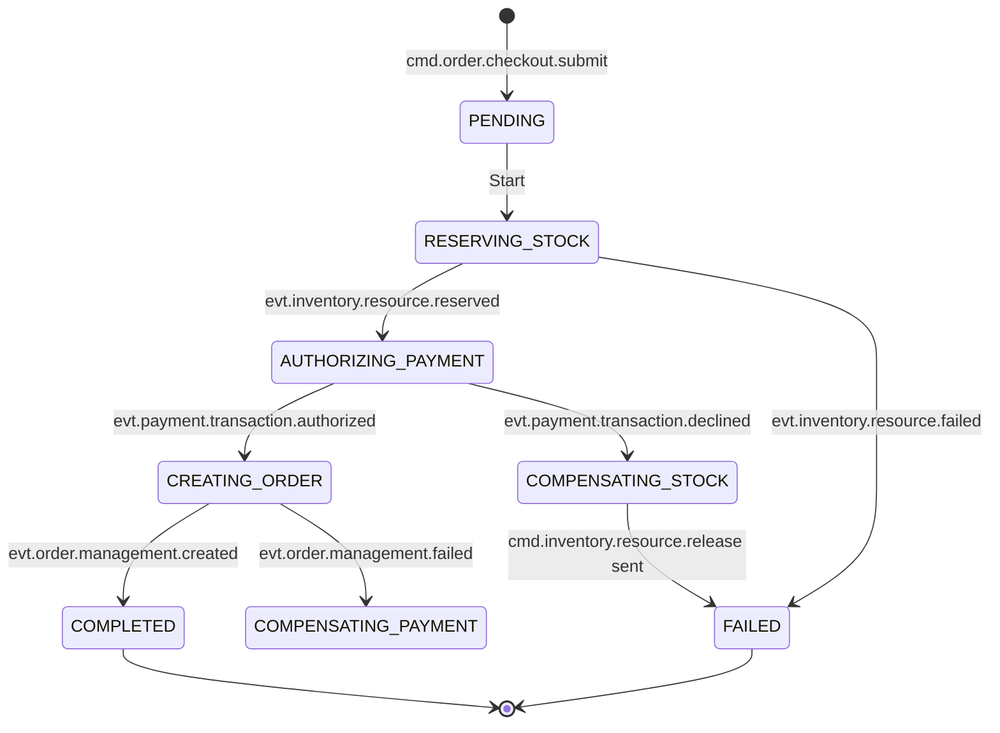

# Architecture: Product Order Capture & Validation (POCV)

## Overview
The POCV Service is a **Stateful Orchestrator** implementing the **Saga Pattern**. It manages the distributed transaction of "Checkout" across asynchronous microservices. It is built to be resilient, idempotent, and auditable.

## 1. Core Principles

### 1.1 Saga Pattern (Orchestration)
We use **Orchestration** (Central Controller) rather than Choreography (Peer-to-Peer) for the Order process.
*   **Why?**: The Checkout flow is complex with strict ordering requirements (Inventory -> Payment -> Order). Centralized logic is easier to monitor, debug, and manage timeouts/compensations.

### 1.2 State Persistence & Durability
*   **Requirement**: Every state transition must be persisted to the database **before** emitting the next command.
*   **Pattern**: **Transactional Outbox**. Update Saga State + Insert Command into Outbox in one transaction.

### 1.3 Idempotency
*   **Inbound**: The `cartId` acts as the idempotency key. Only one active Saga allowed per Cart.
*   **Outbound**: Commands sent to Inventory/Billing include the `sagaId`. Downstream services must use this to deduplicate processing.

## 2. Communication Pattern

### 2.1 Message Topology

#### Ingress (Triggers & Feedbacks)
| Topic / Subject | Payload Schema | Source | Description |
| :--- | :--- | :--- | :--- |
| `cmd.order.checkout.submit` | `SubmitOrderCmd` | BFF | Start the checkout process. |
| `evt.inventory.resource.reserved` | `InventoryReservedEvt` | Inventory | Stock successfully locked. |
| `evt.inventory.resource.failed` | `InventoryFailedEvt` | Inventory | Stock unavailable. |
| `evt.payment.transaction.authorized` | `PaymentAuthorizedEvt` | Billing | Payment captured. |
| `evt.payment.transaction.declined` | `PaymentDeclinedEvt` | Billing | Payment rejected. |
| `evt.order.management.created` | `OrderCreatedEvt` | ProductOrdering | Final order persisted. |

#### Egress (Commands to Domains)
| Topic / Subject | Payload Schema | Target | Description |
| :--- | :--- | :--- | :--- |
| `cmd.inventory.resource.reserve` | `ReserveStockCmd` | Inventory | Request to lock stock. |
| `cmd.inventory.resource.release` | `ReleaseStockCmd` | Inventory | **Compensation**: Undo lock. |
| `cmd.payment.transaction.authorize` | `AuthPaymentCmd` | Billing | Request to charge card. |
| `cmd.order.management.create` | `CreateOrderCmd` | ProductOrdering | Request to store final order. |
| `evt.saga.lifecycle.update` | `SagaStatus` | BFF/UI | WebSocket progress updates. |

## 3. State Machine (The Workflow)

The Saga transitions through these states:



## 4. Internal Architecture (Hexagonal)

```text
internal/
├── core/
│   ├── domain/             # Entities
│   │   ├── saga.go         # SagaInstance Struct & State Constants
│   │   └── steps.go        # Logic for each step (Payload generation)
│   └── ports/              # Interfaces
│       ├── repository.go   # SagaRepository
│       ├── publisher.go    # CommandPublisher
│       └── usecases.go     # Primary Ports
│
├── usecase/                # Application Logic
│   ├── start_saga.go       # Handle cmd.order.submit
│   ├── handle_inventory.go # Handle evt.inv.*
│   ├── handle_payment.go   # Handle evt.payment.*
│   └── timeout_monitor.go  # Background job
│
└── adapter/
    ├── handler/            # RabbitMQ Consumers
    ├── repository/         # Postgres Implementation (GORM)
    ├── worker/             # Outbox Worker
    └── rpc/                # CartClient (to fetch Cart details)
```

## 5. Data Model (PostgreSQL)

### 5.1 `saga_instances` Table
| Column | Type | Notes |
| :--- | :--- | :--- |
| `id` | UUID | PK (Saga ID) |
| `cart_id` | UUID | Unique Index (Idempotency) |
| `customer_id` | UUID | |
| `current_step` | VARCHAR | e.g., "RESERVING_STOCK" |
| `status` | VARCHAR | IN_PROGRESS, COMPLETED, FAILED |
| `payload` | JSONB | Deep copy of the Cart |
| `history` | JSONB | Audit log of events |
| `created_at` | TIMESTAMP | |
| `updated_at` | TIMESTAMP | |

### 5.2 `outbox_events` Table
Standard Outbox table for reliable messaging.

## 6. Error Handling & Recovery

### 6.1 Retry Strategy
*   **Transient Errors** (DB timeout, Broker down): The RabbitMQ Consumer will NACK and retry with exponential backoff. The Saga state remains unchanged until the message is successfully processed.
*   **Domain Errors** (Stock Out, Insufficient Funds): These result in explicit "Failed" events (`evt.inv.failed`) which trigger the **Compensation Logic**.

### 6.2 The "Stuck Saga" Problem
If a downstream service accepts a command but crashes before sending a reply, the Saga hangs.
*   **Solution**: `TimeoutMonitor` (Cron Job).
*   **Logic**: Find Sagas in `IN_PROGRESS` not updated for > 5 mins.
    *   If step is `RESERVING_STOCK`: Assume failed. Transition to `FAILED`.
    *   If step is `AUTHORIZING_PAYMENT`: Assume unknown. Trigger `query.payment.status` OR Void transaction. Transition to `COMPENSATING`.

## 7. Technology Stack
*   **Language**: Go 1.24+
*   **Database**: PostgreSQL 16+ (GORM)
*   **Broker**: RabbitMQ (AMQP 0.9.1)
*   **Serialization**: JSON
