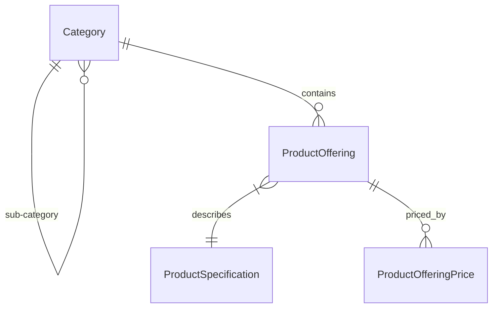

# Analysis: Product Catalog Management (TMF620)

## 1. Goal
Implement the TMF620 Product Catalog Management API to support the definition and lifecycle management of catalogs, categories, product specifications, and product offerings. This service serves as the "source of truth" for all sellable items and their technical definitions.

## 2. Scope
The initial implementation will focus on the following TMF620 entities:

### 2.1 Core Entities

#### Product Specification
*   **Definition**: The invariant characteristics of a product. It defines *what* the product is (technical view).
*   **Example**: "iPhone 13 - 128GB - Midnight" (Specification) vs "iPhone 13 Monthly Plan" (Offering).
*   **Key Attributes**: `name`, `description`, `productNumber`, `lifecycleStatus` (TMF State), `productSpecCharacteristic` (Dynamic attributes e.g., Color, Bandwidth).

#### Product Offering
*   **Definition**: The presentation of one or more Product Specifications to the market. It defines the commercial terms (price, availability).
*   **Dependency**: Must reference a `ProductSpecification`.
*   **Key Attributes**: `name`, `description`, `lifecycleStatus`, `validFor` (TimePeriod), `isBundle` (boolean).

#### Category
*   **Definition**: Used to group Product Offerings or other Categories.
*   **Structure**: Hierarchical (can have sub-categories).

#### Product Offering Price
*   **Definition**: Code charges associated with an offering.
*   **Types**: `recurring`, `one_time`, `usage`.
*   **Key Attributes**: `priceType`, `price` (Money), `unitOfMeasure`, `priceAlteration` (Discounts).

## 3. Relationships

## 4. Requirements
*   **EDA**: All changes must successfully publish events to RabbitMQ.
*   **Validation**:
    *   An Offering cannot be active if its underlying Specification is retired.
    *   Prices must have a currency and value.
*   **Persistence**: PostgreSQL using GORM.

## 5. Use Cases (API Operations)

### 5.1 Catalog Management
*   **Create Catalog**: Define a new catalog to hold categories (e.g., "Consumer Mobile Catalog").
*   **Update Catalog**: Modify catalog details (name, validFor).
*   **Delete Catalog**: Remove a catalog (logical or physical if unused).
*   **List Catalogs**: Retrieve available catalogs for browsing.

### 5.2 Category Management
*   **Create Category**: Create a category node (e.g., "Smartphones", "Plans").
*   **Update Category**: renaming, re-parenting.
*   **Delete Category**: Remove a category node.
*   **Attach to Catalog/Category**: Link a category to a parent catalog or parent category (Hierarchy).
*   **Add/Remove Offering**: Manage the association of offerings to categories.

### 5.3 Product Specification Management
*   **Onboard Specification**: Create a new technical product definition with characteristics (e.g., "5G Service", "iPhone Hardware").
*   **Update Specification**: Modify non-invariant attributes (description, brand).
*   **Delete Specification**: Remove a specification (if not used by any offering).
*   **Configure Characteristics**: Define/Update valid values for spec attributes (e.g., Color: [Red, Blue]).
*   **Retire Specification**: Mark a technical spec as `Retired` (prevents new offerings).

### 5.4 Product Offering Management
*   **Create Offering**: Launch a commercial offer based on a specification.
*   **Update Offering**: Modify commercial details (name, description).
*   **Delete Offering**: Remove an offering (soft-delete or physical if unused).
*   **Manage Attachments**: Add images, user manuals, or terms documents to the offering (Picture).
*   **Define Pricing**: meaningful pricing structures (Recurring vs One-time).
*   **Lifecycle Transition**:
    *   `Draft` -> `Active`: Make offering sellable.
    *   `Active` -> `Retired`: Stop selling new instances (existing subscriptions remain).
    *   `Active` -> `Suspended`: Temporarily halt sales.
*   **Bundle Offerings**: Create a bundled offering (e.g., "Triple Play" = Internet Spec + TV Spec + Phone Spec) - *Future Scope*.

### 5.5 Retrieval & Search
*   **Browse Catalog**: Retrieve the full category hierarchy for a specific catalog (Storefront view).
*   **Get Offering Details**: Retrieve full details including price and spec for the PDP (Product Detail Page).
*   **Filter Offerings**: Search by Category, Price Range, or Specification Characteristics.
*   **Filter Offerings**: Search by Category, Price Range, or Specification Characteristics.
