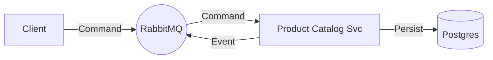

# Architecture: Product Catalog Management (TMF620)

## Overview
This document defines the architecture for the Product Catalog Management service. Following the project's core architectural standards, this service is **100% Asynchronous** and uses a Message Broker (RabbitMQ) for all external interactions.

## 1. Core Principles

### 1.1 Context Propagation
**Requirement**: All methods across all layers (Domain, Infrastructure, Transport) MUST accept `context.Context` as their first parameter.

**Rationale**:
- **Timeout Control**: Ensures database and broker operations are bound by time.
- **Cancellation**: Allows the service to halt processing upon client disconnect or system shutdown.
- **Observability**: Carries trace IDs and other relevant metadata through the system.

### 1.2 Error Handling
- Use domain-specific errors defined in `internal/domain/errors.go`.
- Map infrastructure-specific errors (e.g., `gorm.ErrRecordNotFound`) to domain errors at the boundary.
- Always wrap errors with `%w` to preserve context and type.

### 1.3 Resilience & Consistency
- **RabbitMQ**: Use `ConnectionManager` for automatic reconnection logic.
- **Graceful Shutdown**: Implement `Close()` methods and use `sync.WaitGroup` to ensure all active processing completes before exit.

### 1.4 Logging
- Use structured logging (`log/slog`) with relevant attributes.

## 2. Communication Pattern
We will use an **Event-Driven Architecture (EDA)** with the following patterns:

### 2.1 Command-Query Responsibility Segregation (CQRS)
*   **Commands (Write)**: Sent as messages to a command topic.
*   **Events (State Changes)**: Published to an event stream whenever the state changes.
*   **Queries (Read)**: Handled via an **Async Request-Reply** pattern over the message bus.

### 2.2 Message Topology
We categorize topics/subjects into three types:
*   `cmd.catalog.<entity>.<action>`: For requesting an action.
*   `evt.catalog.<entity>.<state>`: For broadcasting state changes.
*   `query.catalog.<entity>.<lookup>`: For retrieving data.

## 3. Interface Definition (AsyncAPI)

### 3.1 Commands (Inputs)
| Topic / Subject | Payload Schema | Description |
| :--- | :--- | :--- |
| `cmd.catalog.catalog.create` | `CatalogCreateEvent` | Create a new catalog. |
| `cmd.catalog.catalog.update` | `CatalogUpdateEvent` | Update catalog details. |
| `cmd.catalog.catalog.delete` | `CatalogDeleteEvent` | Delete a catalog. |
| `cmd.catalog.category.create` | `CategoryCreateEvent` | Create a new category. |
| `cmd.catalog.category.update` | `CategoryUpdateEvent` | Update category details/hierarchy. |
| `cmd.catalog.category.delete` | `CategoryDeleteEvent` | Delete a category. |
| `cmd.catalog.specification.create` | `ProductSpecificationCreateEvent` | Create a technical specification. |
| `cmd.catalog.specification.update` | `ProductSpecificationUpdateEvent` | Update specification attributes. |
| `cmd.catalog.specification.delete` | `ProductSpecificationDeleteEvent` | Delete a specification. |
| `cmd.catalog.offering.create` | `ProductOfferingCreateEvent` | Create a commercial offering. |
| `cmd.catalog.offering.update` | `ProductOfferingUpdateEvent` | Update offering details/price. |
| `cmd.catalog.offering.delete` | `ProductOfferingDeleteEvent` | Delete/Retire an offering. |

### 3.2 Events (Outputs)
| Topic / Subject | Payload Schema | Trigger |
| :--- | :--- | :--- |
| `evt.catalog.catalog.created` | `Catalog` | Catalog created. |
| `evt.catalog.catalog.updated` | `Catalog` | Catalog updated. |
| `evt.catalog.catalog.deleted` | `CatalogDeleteNotification` | Catalog deleted. |
| `evt.catalog.category.created` | `Category` | Category created. |
| `evt.catalog.category.updated` | `Category` | Category updated. |
| `evt.catalog.category.deleted` | `CategoryDeleteNotification` | Category deleted. |
| `evt.catalog.specification.created` | `ProductSpecification` | Specification created. |
| `evt.catalog.specification.updated` | `ProductSpecification` | Specification updated. |
| `evt.catalog.specification.deleted` | `ProductSpecificationDeleteNotification` | Specification deleted. |
| `evt.catalog.offering.created` | `ProductOffering` | Offering created. |
| `evt.catalog.offering.updated` | `ProductOffering` | Offering updated. |
| `evt.catalog.offering.deleted` | `ProductOfferingDeleteNotification` | Offering deleted. |

### 3.3 Queries (Async Request-Reply)
*   **Queue**: `query.catalog.offering.get`
*   **Queue**: `query.catalog.offering.list` (Filter/Search)
*   **Queue**: `query.catalog.specification.get`
*   **Queue**: `query.catalog.specification.list` (Filter/Search)
*   **Queue**: `query.catalog.catalog.list`
*   **Queue**: `query.catalog.category.list` (Browse Hierarchy)
*   **Pattern**: RPC (Remote Procedure Call).
*   **Request**: `{"id": "offering-123"}`
*   **Response**: `ProductOffering` object JSON.


### 3.4 Advanced Features (Implemented)
The following features are fully supported using standard commands and queries.

#### Attachments
Attachments are managed via the standard `cmd.catalog.offering.create` and `cmd.catalog.offering.update` commands.
- **Payload**: The `ProductOffering` object in the payload includes an `attachments` array.
    ```json
    "attachments": [
      {
        "id": "uuid",
        "name": "Manual",
        "url": "http://...",
        "type": "Document"
      }
    ]
    ```

#### Advanced Filtering
Supported via `query.catalog.offering.list`.
- **Request Payload**:
    ```json
    {
      "category": "category-id",
      "minPrice": 10.0,
      "maxPrice": 100.0,
      "name": "optional-name"
    }
    ```

#### Enriched Retrieval
Supported via `query.catalog.offering.get`.
- **Request Payload**:
    ```json
    {
      "id": "offering-id",
      "enrich": true
    }
    ```
- **Response**: The `ProductOffering` JSON includes fully populated `productSpecification` and `categories` objects.

## 4. Technology Stack Selection
*   **Message Broker**: RabbitMQ.
*   **Database**: PostgreSQL with GORM.
*   **Language**: Go 1.23+.

## 5. Internal Architecture (Clean Architecture)
To ensure maintainability and testability, we strictly follow **Clean Architecture**. The application core is independent of frameworks (HTTP, RabbitMQ, GORM).

### 5.1 Directory Structure
We group code by **Domain Topic** and then by **Layer**. Use cases are explicitly defined, not hidden in "Service" classes.

```text
internal/
├── core/                   # The Inner Ring (Pure Domain)
│   ├── domain/             # Entities & Value Objects (No dependencies)
│   │   ├── catalog.go
│   │   ├── offering.go
│   │   └── ...
│   └── ports/              # Interfaces (Input/Output Ports)
│       ├── repositories.go # Secondary ports
│       └── usecases.go     # Primary ports
│
├── usecase/                # Application Business Rules (Grouped by Topic)
│   ├── catalog/            # Topic: Catalog
│   │   ├── create_catalog.go  # Distinct Use Case struct
│   │   ├── list_catalogs.go
│   │   └── ...
│   ├── category/           # Topic: Category
│   │   ├── create_category.go
│   │   └── ...
│   ├── offering/           # Topic: Product Offering
│   │   ├── create_offering.go
│   │   └── ...
│   ├── specification/      # Topic: Product Specification
│   │   └── ...
│
└── adapter/                # The Outer Ring (Implementation)
    ├── handler/            # Driving Adapters (RabbitMQ Consumers)
    └── repository/         # Driven Adapters (Postgres/GORM)
```

### 5.2 Use Case Definition
Every user intention (e.g., "Create Catalog") MUST map to a dedicated Use Case struct/function in the `usecase` package.
*   **Isolation**: Business logic depends ONLY on the Domain and Ports (Interfaces), never on `adapter`.
*   **Granularity**: Avoid monolithic "CatalogService". Prefer `catalog.NewCreateUseCase(...)`.

## 6. Deployment Diagram


## 7. Security & Best Practices
### 5.1 Database Security (Anti-Injection)
When implementing dynamic search or filtering, we strictly prohibit string interpolation for SQL identifiers. Use the "Safe Dynamic Query" pattern with explicit switch cases.

### 5.2 Audit Logging
All database modifications MUST be traceable to a user identity via propagated context.
