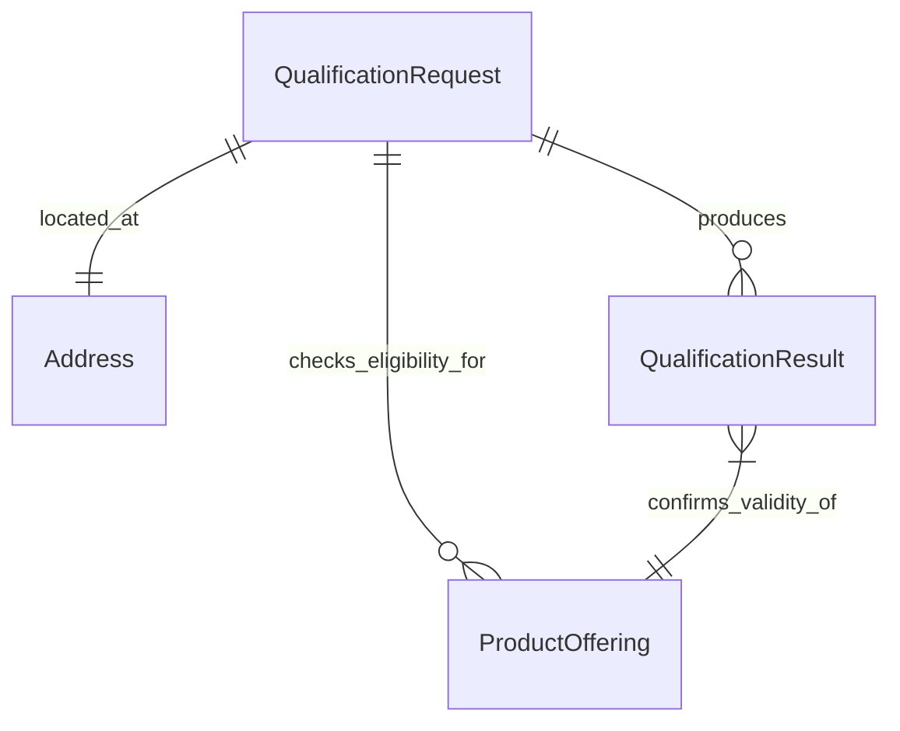

# Analysis: Qualification Service (TMF679)

## 1. Goal
Implement the TMF679 Product Offering Qualification API to determine the technical and commercial feasibility of providing a service to a specific customer location. This service acts as the "Gatekeeper" of the sales process, ensuring no order is placed for a product that cannot be delivered.

## 2. Scope
The implementation focuses on the "Serviceability Check" and "Commercial Eligibility" for the Fiber Internet product line.

### 2.1 Core Entities

#### Product Offering Qualification
*   **Definition**: A request to check if a specific Product Offering (or a Category of offerings) can be provided at a specific Place.
*   **Key Attributes**: `id`, `qualificationDate`, `state` (Qualified, Unqualified, InProgress), `eligibilityResult`.

#### Serviceability (Technical)
*   **Geographic Availability**: Is the address inside the service provider's footprint?
*   **Resource Availability**: Are there physical resources (Ports) available at the Network Edge (OLT/Cabinet)?
*   **Technology Match**: What is the maximum speed/technology (GPON, XGS-PON) at this location?

#### Commercial Eligibility (Business)
*   **Catalog Filtering**: Which Offerings match the technical capabilities?
*   **Rule Validation**: Are there business constraints (e.g., Exclusive regions, Customer Type restrictions)?

## 3. Relationships


## 4. Requirements
*   **Async-First**: Must use RabbitMQ for all checks to decouple from slow GIS/Inventory backends.
*   **Scatter-Gather**: Must query multiple backends in parallel (GIS, Inventory, Catalog) to minimize user wait time.
*   **TMF Compliance**: Must map internal logic to TMF679 standard attributes.
*   **Idempotency**: Repeated checks for the same address/offering should yield consistent results (caching strategy).
*   **Session Persistence**: Must store qualification sessions with customer-specific prices for reuse by Shopping Cart.
*   **Price Consistency**: Prices calculated during qualification MUST match prices used in Shopping Cart (legal requirement).
*   **Session Expiry**: Sessions must have TTL (e.g., 24 hours) to prevent stale pricing.

## 5. Use Cases (API Operations)

### 5.1 Check Eligibility (Main Flow)
*   **Check Qualification**: The primary operation. Accepts an Address and an optional Category/Offering.
    1.  **Validate Address**: Ensure address format is correct (and normalized via GIS).
    2.  **Check Coverage**: Query GIS for polygon/footprint match.
    3.  **Check Resources**: Query Inventory for free ports.
    4.  **Filter Catalog**: specific Offerings that match the technical result.
    5.  **Return Result**: Qualified/Unqualified with reasons.

### 5.2 Get Qualification Session (NEW)
*   **Get Session**: Retrieve a qualification session by ID. Used by Shopping Cart to get customer-specific prices.
    1.  **Validate Session**: Check if session exists and is not expired.
    2.  **Return Session**: Return qualified offerings with prices.

### 5.3 Validate Session (NEW)
*   **Validate Session**: Check if a session is still valid (not expired, prices still current).
    1.  **Check Expiry**: Verify session timestamp.
    2.  **Optional Price Revalidation**: Check if catalog prices changed.
    3.  **Return Status**: Valid/Expired/PriceChanged.

### 5.4 Management
*   **Update Qualification State**: (Internal) Update the status if a check is long-running (deferred).

## 6. Architecture & Implementation Design

### 6.1 Asynchronous Scatter-Gather Pattern
The service operates strictly via **RabbitMQ** for all inputs and outputs.

1.  **Command Ingress**: Receives `cmd.qual.check` from the BFF.
2.  **Scatter**: Spawns concurrent RPC queries to:
    *   **GIS Service**: `query.gis.check_polygon` (Check coverage).
    *   **Inventory Service**: `query.inv.port_capacity` (Check ports).
    *   **Catalog Service**: `query.catalog.filter` (Get offers).
3.  **Gather & Logic**: Aggregates results. If `In_Polygon == true` AND `Ports > 0`, the location is **Qualified**.
4.  **Event Egress**: Publishes `evt.qual.checked` with the result.

### 6.2 Hexagonal Architecture
The service follows the project's strict clean architecture:
*   **Core/Domain**: Pure logic (`EligibilityResult`, Rules).
*   **Core/Ports**: Interfaces for `GISClient`, `InventoryClient`, `CatalogClient`, `Publisher`.
*   **Adapter**: RabbitMQ Handlers/Publishers and RPC Clients.

## 7. Interface Definition (AsyncAPI)

### 7.1 Input: Check Qualification Command
**Topic**: `cmd.qual.check`
```json
{
  "correlationId": "req-123",
  "replyTo": "q.bff.reply.123",
  "address": {
    "street": "Main St",
    "number": "55",
    "city": "Berlin",
    "zip": "10115"
  },
  "categoryFilter": ["Internet", "VoIP"]
}
```

### 7.2 Output: Qualification Checked Event
**Topic**: `evt.qual.checked`
```json
{
  "correlationId": "req-123",
  "qualificationId": "Q_999",
  "status": "Qualified",
  "eligibleCategories": [
    {
      "id": "CAT_FIBER",
      "name": "Fiber Internet",
      "characteristics": {
        "MaxSpeed": "1000Mbps",
        "Technology": "GPON"
      }
    }
  ],
  "unavailabilityReason": null
}
```

## 8. Gap Analysis & Roadmap

The current codebase is a foundational skeleton. The following gaps must be addressed to meet the requirements defined above.

### 8.1 Critical Gaps (Must Have)
1.  **Catalog Integration**:
    *   *Requirement*: Filter actual Catalog Offerings based on technical capabilities.
    *   *Current*: Hardcoded "CAT_FIBER" response.
    *   *Action*: Implement `CatalogClient` to query the Product Catalog service.
2.  **Detailed GIS Client**:
    *   *Requirement*: Accurate serviceability check against geospatial data.
    *   *Current*: Mock implementation.
    *   *Action*: Implement real integration or advanced mock with Polygon math.
3.  **Address Normalization**:
    *   *Requirement*: Validate address existence before checking serviceability (TMF673).
    *   *Current*: Raw string acceptance.
    *   *Action*: Integrate with Geographic Address Management.
4.  **Caching Layer**:
    *   *Requirement*: Fast response for repeated checks.
    *   *Current*: None.
    *   *Action*: Implement Redis caching for GIS results.
