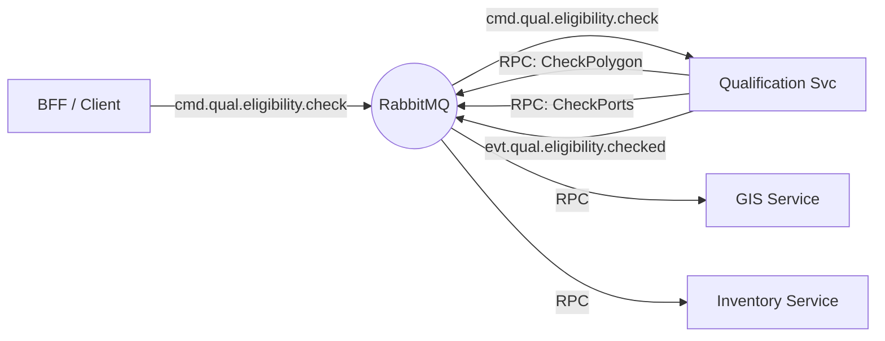

# Architecture: Qualification Service (TMF679)

## Overview
The Qualification Service is a stateless, reactive orchestration engine designed to determine the technical and commercial feasibility of a product offering at a specific location. Unlike CRUD-based services, it implements a **Scatter-Gather** pattern to parallelize queries to backend systems (GIS, Inventory, Catalog) to ensure low-latency responses for sales channels.

## 1. Core Principles
To maintain consistency with the wider system, strict adherence to these principles is required.

### 1.1 Context Propagation
**Requirement**: All methods across all layers (Domain, Infrastructure, Transport) MUST accept `context.Context` as their first parameter.

**Rationale**:
- **Timeout Control**: Critical for the Scatter-Gather pattern. If backend checks (e.g., Inventory) are too slow, the context deadline ensures the request fails fast rather than hanging the client.
- **Cancellation**: Allows the service to halt processing upon system shutdown.
- **Observability**: Carries trace IDs and other relevant metadata.

### 1.2 Error Handling
- Use domain-specific errors defined in `internal/core/domain/errors.go`.
- Map infrastructure-specific errors (e.g., RabbitMQ timeout, RPC failure) to domain errors at the boundary.
- Always wrap errors with `%w` to preserve context and type.

### 1.3 Resilience
- **Graceful Shutdown**: Implement `Close()` methods and use `sync.WaitGroup` to ensure all active processing completes before exit.
- **Timeouts**: Every external RPC call (GIS, Inventory) MUST have a strict timeout derived from the parent context.
- **Partial Failures**: The service must decide whether to fail the whole request or return "Unknown" if a non-critical backend fails (Configurable).

### 1.4 Logging
- Use structured logging (`log/slog`) with relevant attributes (`qualificationId`, `correlationId`).

### 1.5 Testing Standards
- **Mandatory Coverage**: All functionality must be covered by both **Unit Tests** (for domain logic/rules engine) and **Integration Tests** (for the scatter-gather flow).
- **Zero Regressions**: No code shall be merged without passing tests.

## 2. Communication Pattern
The service participates in a **Request-Response via Events** flow:

### 2.1 Scatter-Gather Pattern
1.  **Ingress**: Receives a `cmd.qual.eligibility.check` command.
2.  **Process (Scatter)**: Spawns concurrent RPC queries (using `errgroup`) to:
    *   **GIS Service**: Verify geographic footprint.
    *   **Inventory Service**: Verify port capacity.
    *   **Catalog Service**: Filter eligible offerings.
3.  **Process (Gather)**: Aggregates results into a final `EligibilityResult`.
4.  **Egress**: Publishes an `evt.qual.eligibility.checked` event with the decision.

### 2.2 Message Topology

| Type | Topic / Subject | Description |
| :--- | :--- | :--- |
| **Input (Command)** | `cmd.qual.eligibility.check` | Request to check eligibility for an address. |
| **Output (Event)** | `evt.qual.eligibility.checked` | Result of the check (Qualified/Unqualified). |
| **Dependency (Query)** | `query.gis.geography.check` | RPC to GIS Service. |
| **Dependency (Query)** | `query.inventory.resource.capacity` | RPC to Inventory Service. |
| **Dependency (Query)** | `query.catalog.offering.filter` | RPC to Product Catalog Service. |

## 3. Interface Definition (AsyncAPI)

### 3.1 Input: Check Qualification Command
**Topic**: `cmd.qual.eligibility.check`
**Payload**:
```json
{
  "correlationId": "req-123",
  "replyTo": "q.bff.reply.123",
  "address": {
    "street": "Main St",
    "number": "55",
    "city": "Berlin",
    "zip": "10115"
  },
  "categoryFilter": ["Internet"]
}
```

### 3.2 Output: Qualification Checked Event
**Topic**: `evt.qual.eligibility.checked`
**Payload**:
```json
{
  "correlationId": "req-123",
  "qualificationId": "Q_999",
  "status": "Qualified", // Qualified, Unqualified, Error
  "eligibleCategories": [
    {
      "id": "CAT_FIBER",
      "name": "Fiber Internet",
      "characteristics": {
        "MaxSpeed": "1000Mbps",
        "Technology": "GPON"
      }
    }
  ],
  "reason": null
}
```

## 4. Internal Architecture (Clean Architecture)
To ensure maintainability and testability, we strictly follow **Clean Architecture**. The application core is independent of frameworks (RabbitMQ).

### 4.1 Directory Structure
```text
internal/
├── core/                   # The Inner Ring (Pure Domain)
│   ├── domain/             # Entities & Value Objects
│   │   ├── models.go       # Address, EligibilityResult
│   │   └── rules.go        # Qualification Logic/Rules
│   └── ports/              # Interfaces (Input/Output Ports)
│       ├── ports.go        # Driver (UseCase) & Driven (Clients) interfaces
│
├── usecase/                # Application Business Rules
│   ├── check_eligibility.go # Use Case: CheckEligibility
│   └── ...
│
└── adapter/                # The Outer Ring (Implementation)
    ├── handler/            # Driving Adapters (RabbitMQ Consumers)
    ├── rpc/                # Driven Adapters (GIS/Inv/Catalog Clients)
    └── publisher/          # Driven Adapters (RabbitMQ Publisher)
```

### 4.2 Use Case Definition
The primary user intention "Check Eligibility" maps to `usecase.CheckEligibility`.
*   **Isolation**: Business logic depends ONLY on the Domain and Ports.
*   **Concurrency**: The Use Case manages the `errgroup` logic for parallel execution.

## 5. Technology Stack
- **Languages**: Go 1.23+
- **Messaging**: RabbitMQ (AMQP 0.9.1)
- **Database**: None (Stateless Service).
- **Caching**: Redis (Optional, for GIS Polygon caching).

## 6. Deployment Diagram

