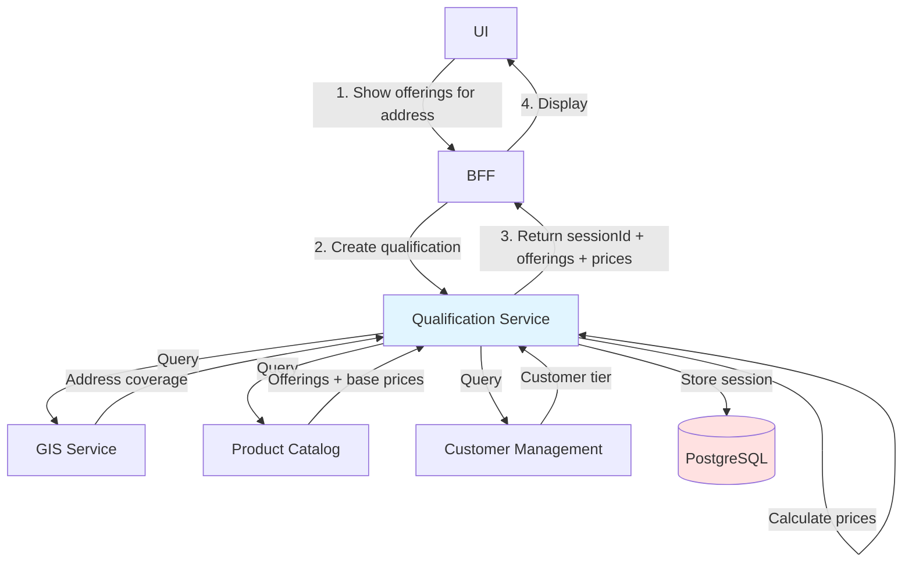
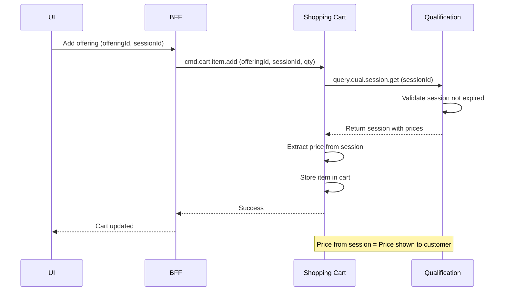
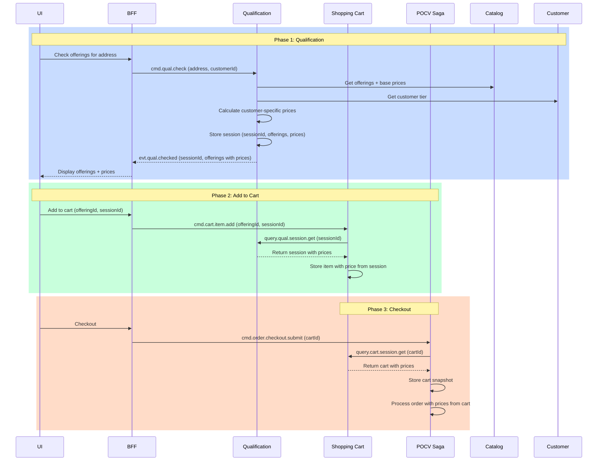
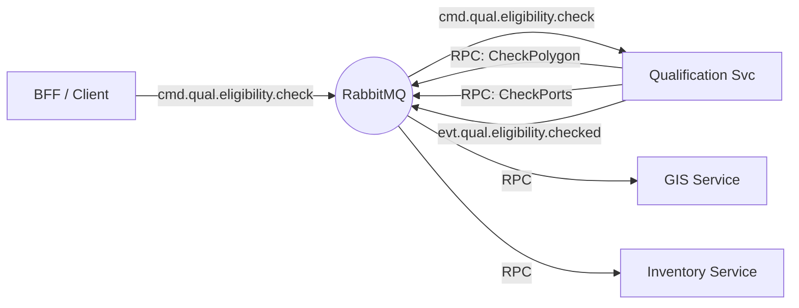

# Architecture: Qualification Service (TMF679)

## Overview
The Qualification Service is a stateless, reactive orchestration engine designed to determine the technical and commercial feasibility of a product offering at a specific location. Unlike CRUD-based services, it implements a **Scatter-Gather** pattern to parallelize queries to backend systems (GIS, Inventory, Catalog) to ensure low-latency responses for sales channels.

## 1. Core Principles
To maintain consistency with the wider system, strict adherence to these principles is required.

### 1.1 Context Propagation
**Requirement**: All methods across all layers (Domain, Infrastructure, Transport) MUST accept `context.Context` as their first parameter.

**Rationale**:
- **Timeout Control**: Critical for the Scatter-Gather pattern. If backend checks (e.g., Inventory) are too slow, the context deadline ensures the request fails fast rather than hanging the client.
- **Cancellation**: Allows the service to halt processing upon system shutdown.
- **Observability**: Carries trace IDs and other relevant metadata.

### 1.2 Error Handling
- Use domain-specific errors defined in `internal/core/domain/errors.go`.
- Map infrastructure-specific errors (e.g., RabbitMQ timeout, RPC failure) to domain errors at the boundary.
- Always wrap errors with `%w` to preserve context and type.

### 1.3 Resilience
- **Graceful Shutdown**: Implement `Close()` methods and use `sync.WaitGroup` to ensure all active processing completes before exit.
- **Timeouts**: Every external RPC call (GIS, Inventory) MUST have a strict timeout derived from the parent context.
- **Partial Failures**: The service must decide whether to fail the whole request or return "Unknown" if a non-critical backend fails (Configurable).

### 1.4 Logging
- Use structured logging (`log/slog`) with relevant attributes (`qualificationId`, `correlationId`).

### 1.5 Testing Standards
- **Mandatory Coverage**: All functionality must be covered by both **Unit Tests** (for domain logic/rules engine) and **Integration Tests** (for the scatter-gather flow).
- **Zero Regressions**: No code shall be merged without passing tests.

## 2. Communication Pattern
The service participates in a **Request-Response via Events** flow:

### 2.1 Scatter-Gather Pattern
1.  **Ingress**: Receives a `cmd.qual.eligibility.check` command.
2.  **Process (Scatter)**: Spawns concurrent RPC queries (using `errgroup`) to:
    *   **GIS Service**: Verify geographic footprint.
    *   **Inventory Service**: Verify port capacity.
    *   **Catalog Service**: Filter eligible offerings.
3.  **Process (Gather)**: Aggregates results into a final `EligibilityResult`.
4.  **Egress**: Publishes an `evt.qual.eligibility.checked` event with the decision.

### 2.2 Message Topology

| Type | Topic / Subject | Description |
| :--- | :--- | :--- |
| **Input (Command)** | `cmd.qual.eligibility.check` | Request to check eligibility for an address. |
| **Output (Event)** | `evt.qual.eligibility.checked` | Result of the check (Qualified/Unqualified). |
| **Dependency (Query)** | `query.gis.geography.check` | RPC to GIS Service. |
| **Dependency (Query)** | `query.inventory.resource.capacity` | RPC to Inventory Service. |
| **Dependency (Query)** | `query.catalog.offering.filter` | RPC to Product Catalog Service. |

## 3. Interface Definition (AsyncAPI)

### 3.1 Input: Check Qualification Command
**Topic**: `cmd.qual.eligibility.check`
**Payload**:
```json
{
  "correlationId": "req-123",
  "replyTo": "q.bff.reply.123",
  "address": {
    "street": "Main St",
    "number": "55",
    "city": "Berlin",
    "zip": "10115"
  },
  "categoryFilter": ["Internet"]
}
```

### 3.2 Output: Qualification Checked Event
**Topic**: `evt.qual.eligibility.checked`
**Payload**:
```json
{
  "correlationId": "req-123",
  "qualificationId": "Q_999",
  "status": "Qualified", // Qualified, Unqualified, Error
  "eligibleCategories": [
    {
      "id": "CAT_FIBER",
      "name": "Fiber Internet",
      "characteristics": {
        "MaxSpeed": "1000Mbps",
        "Technology": "GPON"
      }
    }
  ],
  "reason": null
}
```

## 4. Internal Architecture (Clean Architecture)
To ensure maintainability and testability, we strictly follow **Clean Architecture**. The application core is independent of frameworks (RabbitMQ).

### 4.1 Directory Structure
```text
internal/
├── core/                   # The Inner Ring (Pure Domain)
│   ├── domain/             # Entities & Value Objects
│   │   ├── models.go       # Address, EligibilityResult
│   │   └── rules.go        # Qualification Logic/Rules
│   └── ports/              # Interfaces (Input/Output Ports)
│       ├── ports.go        # Driver (UseCase) & Driven (Clients) interfaces
│
├── usecase/                # Application Business Rules
│   ├── check_eligibility.go # Use Case: CheckEligibility
│   └── ...
│
└── adapter/                # The Outer Ring (Implementation)
    ├── handler/            # Driving Adapters (RabbitMQ Consumers)
    ├── rpc/                # Driven Adapters (GIS/Inv/Catalog Clients)
    └── publisher/          # Driven Adapters (RabbitMQ Publisher)
```

### 4.2 Use Case Definition
The primary user intention "Check Eligibility" maps to `usecase.CheckEligibility`.
*   **Isolation**: Business logic depends ONLY on the Domain and Ports.
*   **Concurrency**: The Use Case manages the `errgroup` logic for parallel execution.

## 5. Qualification Session Architecture (TMF679 Extension)

> [!IMPORTANT]
> **Evolution**: The service is being extended from stateless to **session-based** to support TMF679 qualification sessions with customer-specific pricing.

### 5.1 Why Sessions?

**Problem**: If pricing is calculated separately in BFF (for display) and Shopping Cart (for cart), prices might differ → **legal liability**.

**Solution**: Qualification creates a **persistent session** with:
- Qualified offerings
- **Customer-specific prices** (calculated once)
- Eligibility results
- Session ID (reusable)

### 5.2 Session Flow

#### Customer Browses Catalog



#### Add to Cart Flow



#### Complete E2E Flow



### 5.3 Session Data Model

```go
type QualificationSession struct {
    ID              string                 `json:"id"`
    CustomerID      string                 `json:"customerId"`
    Address         Address                `json:"address"`
    QualifiedOffers []QualifiedOffer       `json:"qualifiedOffers"`
    Status          string                 `json:"status"` // "QUALIFIED", "UNQUALIFIED"
    CreatedAt       time.Time              `json:"createdAt"`
    ExpiresAt       time.Time              `json:"expiresAt"` // 24 hours
}

type QualifiedOffer struct {
    OfferingID      string                 `json:"offeringId"`
    OfferingName    string                 `json:"offeringName"`
    Price           Price                  `json:"price"` // Customer-specific
    Eligibility     string                 `json:"eligibility"`
    Constraints     []string               `json:"constraints,omitempty"`
}

type Price struct {
    Amount          float64                `json:"amount"`
    Currency        string                 `json:"currency"`
    TaxIncluded     bool                   `json:"taxIncluded"`
}
```

### 5.4 New RPC Endpoints

| Topic | Direction | Purpose |
|:------|:----------|:--------|
| `query.qual.session.get` | IN (RPC) | Shopping Cart queries session by ID |
| `query.qual.session.validate` | IN (RPC) | Validate session is still valid |

### 5.5 Session Storage

**Options:**
- **Redis**: Fast, TTL support, but ephemeral
- **Postgres**: Durable, auditable, but slower

**Recommendation**: **Postgres** for legal compliance and auditability.

**Database Schema:**
```sql
CREATE TABLE qualification_sessions (
    id UUID PRIMARY KEY,
    customer_id UUID NOT NULL,
    address JSONB NOT NULL,
    qualified_offers JSONB NOT NULL,
    status VARCHAR(50) NOT NULL,
    created_at TIMESTAMP NOT NULL DEFAULT NOW(),
    expires_at TIMESTAMP NOT NULL,
    INDEX idx_customer_id (customer_id),
    INDEX idx_expires_at (expires_at)
);
```

### 5.6 Implementation Changes

**Qualification Service:**
1. Add PostgreSQL database (currently stateless)
2. Add repository layer for session persistence
3. Add pricing calculation logic (query catalog + customer)
4. Add RPC handler: `query.qual.session.get`
5. Add RPC handler: `query.qual.session.validate`

**Shopping Cart Service:**
1. Accept `qualificationSessionId` in `cmd.cart.item.add`
2. Add Qualification RPC client
3. Query qualification session for prices
4. Remove independent pricing calculation

**BFF Service:**
1. Display `sessionId` to UI (for debugging)
2. Pass `sessionId` when adding to cart

### 5.7 Benefits

✅ **Legal Compliance**: Price shown = price charged (same session)
✅ **TMF Aligned**: Qualification is the pricing authority
✅ **Performance**: Calculate once, reuse many times
✅ **Auditable**: Sessions persisted with timestamp
✅ **Consistency**: Single source of truth

### 5.8 Open Questions

1. **Session Expiry**: How long should qualification sessions be valid? (Recommendation: 24 hours)
2. **Price Changes**: What if catalog price changes after qualification? (Options: notify customer, invalidate session)
3. **Session Cleanup**: How to handle expired sessions? (Recommendation: background job)
4. **Backward Compatibility**: Can we add this without breaking existing flow? (Yes, make sessionId optional initially)

---

## 6. Technology Stack
- **Languages**: Go 1.23+
- **Messaging**: RabbitMQ (AMQP 0.9.1)
- **Database**: PostgreSQL 16+ (for qualification sessions)
- **Caching**: Redis (Optional, for GIS Polygon caching).

## 7. Deployment Diagram

